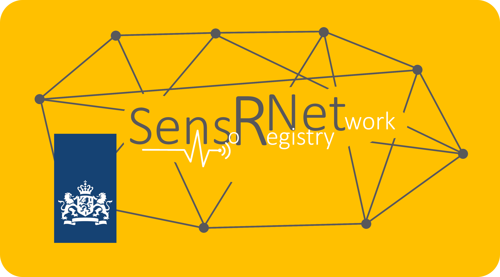

# Home of the SensRNet



SensRNet - The Dutch National Sensor Registry Network

Publication of documentation: https://kadaster-labs.github.io/sensrnet-home/

## Build & Publication

```bash
$ docker run --rm -it -p 8000:8000 -v ${PWD}:/docs squidfunk/mkdocs-material gh-deploy
```
---

## Find Us

* [GitHub](https://github.com/kadaster-labs/sensrnet-home)

## Contributing

Please read [CONTRIBUTING.md](CONTRIBUTING.md) for details on our code of conduct, and the process for submitting pull requests to us.

## Maintainers <a name="maintainers"></a>

Should you have any questions or concerns, please reach out to one of the project's [Maintainers](./MAINTAINERS.md).

## License

This work is licensed under a [EUPL v1.2 license](./LICENSE.md). All documentation is licensed under [CC BY 4.0](https://creativecommons.org/licenses/by/4.0/)
