# Contributors

## Committors

Parties with commitment to the code, the documentation and the community

    <a href="https://brabantstad.nl" target="_blank" rel="noopener noreferrer">
        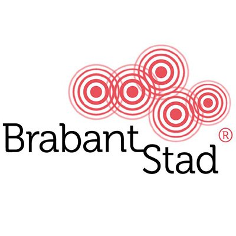
    </a>
    <a href="https://kadaster.nl" target="_blank" rel="noopener noreferrer">
        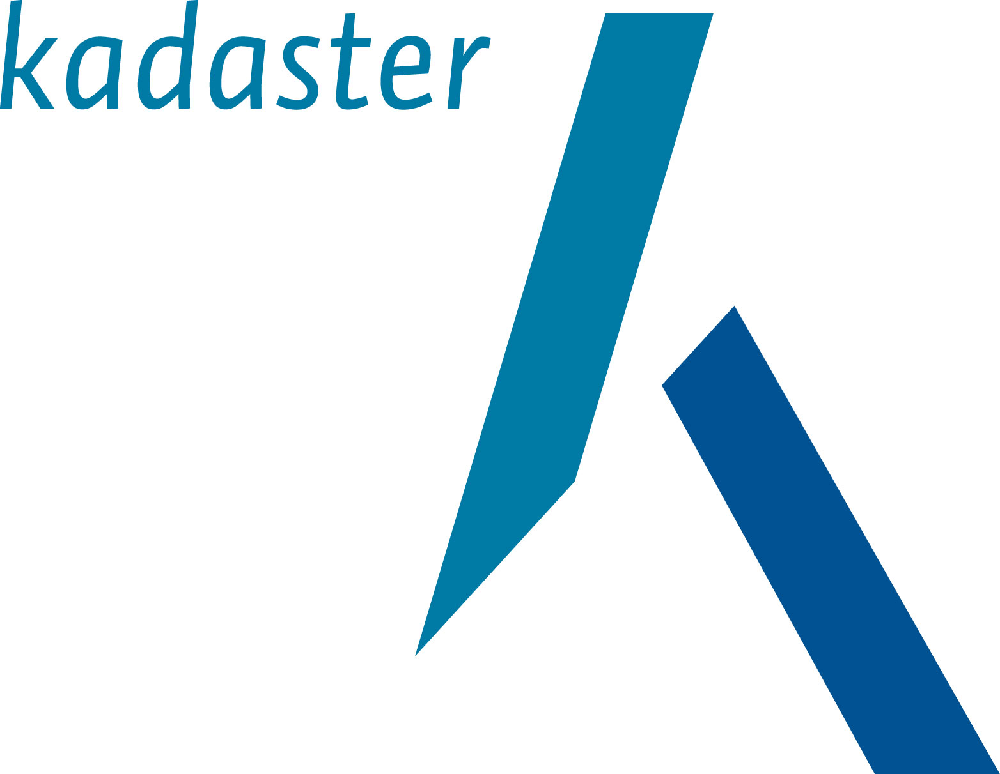
    </a>
    

## Contributors

Parties with contributions to the code, the documentation and the community

    <a href="https://brabant.nl" target="_blank" rel="noopener noreferrer">
        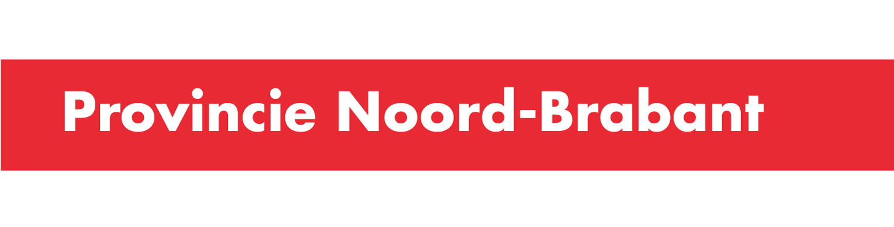
    </a>
    
    
    <a href="https://nijmegen.nl" target="_blank" rel="noopener noreferrer">
        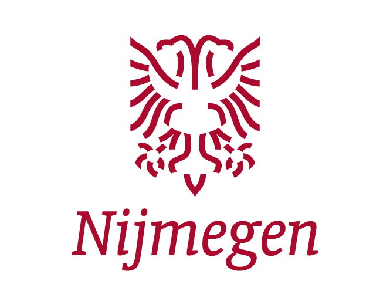
    </a>
    <a href="https://utrecht.nl" target="_blank" rel="noopener noreferrer">
        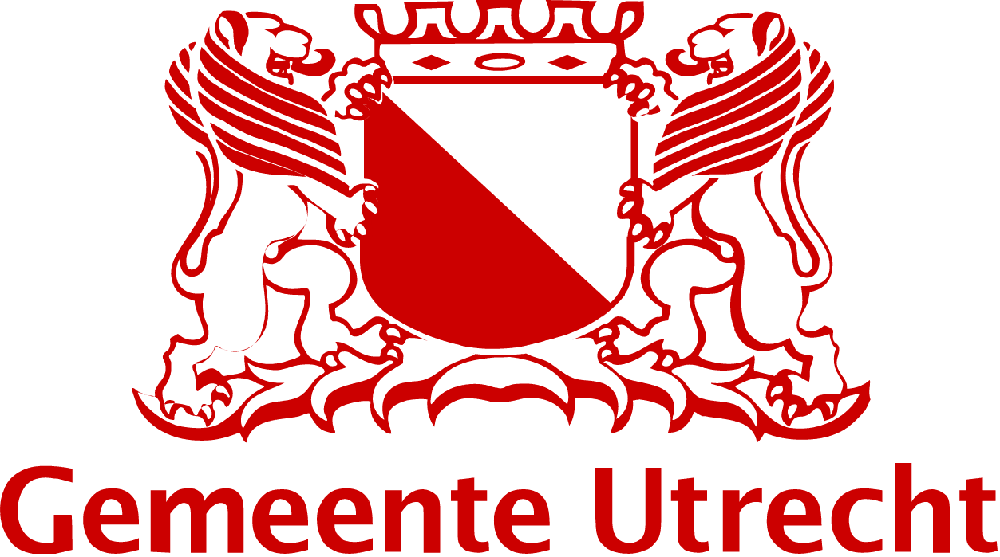
    </a>
    <a href="https://helmond.nl" target="_blank" rel="noopener noreferrer">
        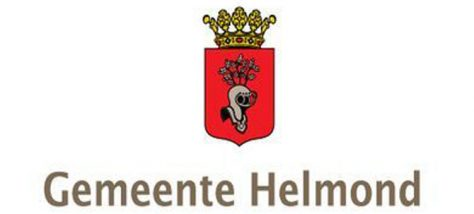
    </a>
    <a href="https://breda.nl" target="_blank" rel="noopener noreferrer">
        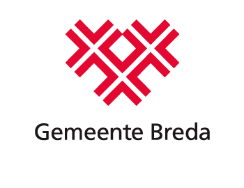
    </a>
    
    <a href="https://amsterdam.nl/" target="_blank" rel="noopener noreferrer">
        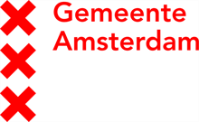
    </a>

## Community

Parties connected and participating in the community

    
    <a href="https://zwolle.nl" target="_blank" rel="noopener noreferrer">
        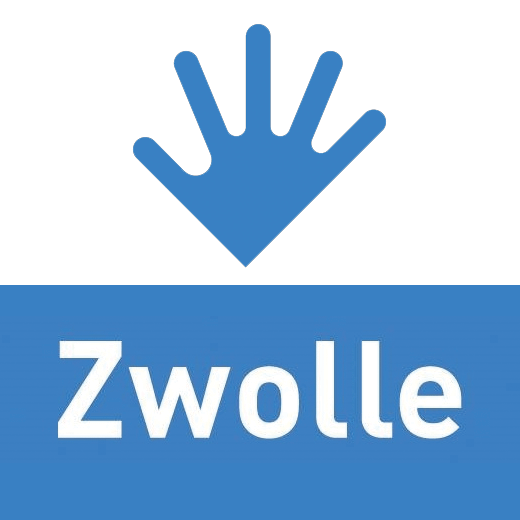
    </a>
    <a href="https://www.ams-institute.org/" target="_blank" rel="noopener noreferrer">
        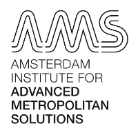
    </a>
    <a href="https://rivm.nl" target="_blank" rel="noopener noreferrer">
        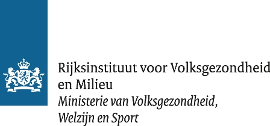
    </a>

