# Contributors

## Initiatiefnemers

    <a href="https://brabantstad.nl" target="_blank" rel="noopener noreferrer">
        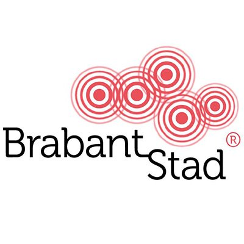
    </a>
    <a href="https://kadaster.nl" target="_blank" rel="noopener noreferrer">
        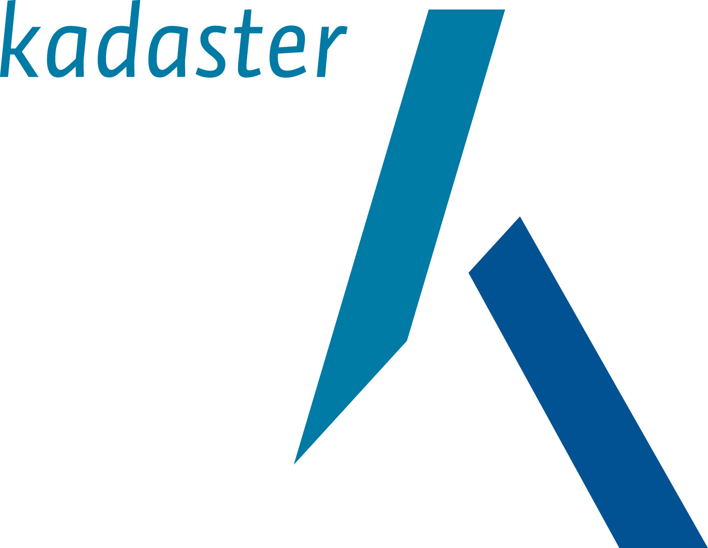
    </a>
    
    <a href="https://www.rijksoverheid.nl/ministeries/ministerie-van-binnenlandse-zaken-en-koninkrijksrelaties" target="_blank" rel="noopener noreferrer">
        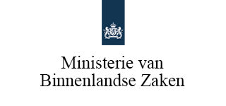
    </a>

## Community

    <a href="https://brabant.nl" target="_blank" rel="noopener noreferrer">
        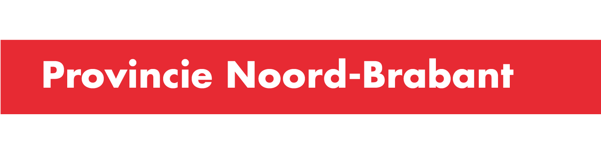
    </a>
    
    
    
    <a href="https://nijmegen.nl" target="_blank" rel="noopener noreferrer">
        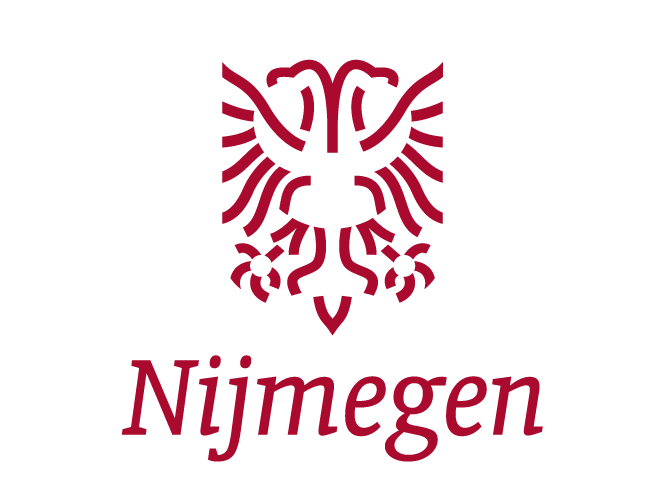
    </a>
    <a href="https://utrecht.nl" target="_blank" rel="noopener noreferrer">
        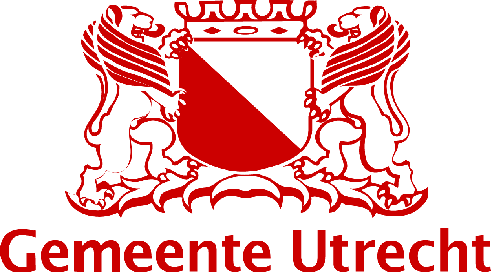
    </a>
    <a href="https://helmond.nl" target="_blank" rel="noopener noreferrer">
        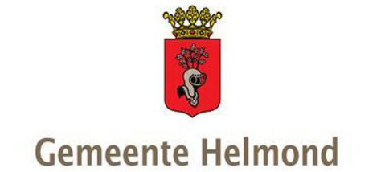
    </a>
    <a href="https://breda.nl" target="_blank" rel="noopener noreferrer">
        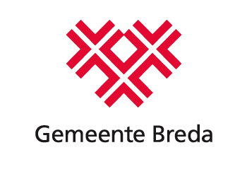
    </a>
    
    
    <a href="https://amsterdam.nl/" target="_blank" rel="noopener noreferrer">
        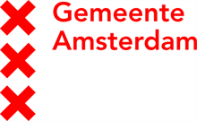
    </a>
    <a href="https://rotterdam.nl/" target="_blank" rel="noopener noreferrer">
        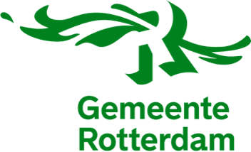
    </a>
    
    
    
    <a href="https://zwolle.nl" target="_blank" rel="noopener noreferrer">
        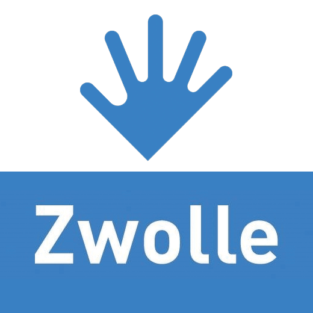
    </a>
    <a href="https://www.ams-institute.org/" target="_blank" rel="noopener noreferrer">
        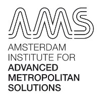
    </a>
    

