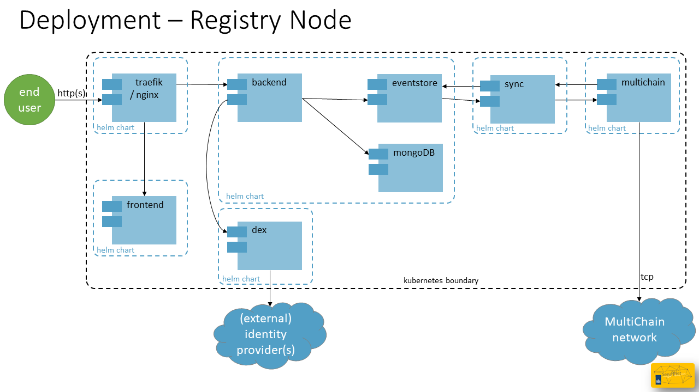

# Deployment (EN)

Deployment is about how the system is running in a (production) environment. This page is targeted on the SensRNet Registry Node and the Publishing Node is omitted for this moment.

SensRNet components are packaged in [Docker](https://www.docker.com/resources/what-container) containers.
These containers are designed to be run on [Kubernetes](https://kubernetes.io/), an open source, container orchestration platform.
Kubernetes can be deployed in your own datacenter or can be purchased at one of the cloud providers.

As of February 2021 the SensRNet components can be installed with [Helm](https://helm.sh/), the Kubernetes package manager. This is also the basis of the VNG/CommonGround [Haven](https://haven.commonground.nl/) initiative, which standardizes the cloud-agnostic infrastructure. The SensRNet components can be found in the [Common Ground Componentencatalogus](https://componentencatalogus.commonground.nl/componenten?query=sensr).

The Helm charts for SensRNet can be found in a separate repository: [kadaster-labs/sensrner-helm-charts](https://github.com/kadaster-labs/sensrnet-helm-charts) including installation instructions.




## Azure AKS example

This installation is tested on [Microsoft Azure](https://azure.microsoft.com/nl-nl/overview/). AKS stands for [Microsoft Azure Kubernetes Service](https://azure.microsoft.com/nl-nl/services/kubernetes-service/) and is the 'Microsoft taste' / way of providing managed Kubernetes to their clients. This can also be created following the [Haven installation manual](https://haven.commonground.nl/docs/aan-de-slag/azure). Afterwards you can check whether you're [Haven compliant](https://haven.commonground.nl/docs/compliancy-checker) or not.


1. Decide on Azure subscription and prepare cli access

   ```
   $ az login

   $ az account set --subscription "your subscription name/ID"
   ```

1. Create a fresh resource group `sensrnet-registry`

   ```
   $ az group create --name sensrnet-registry --location westeurope
   ```

1. Create a new AKS cluster `aks-sensrnet-registry-1`

   ```
   $ az aks create --resource-group sensrnet-registry --name aks-sensrnet-registry-1 --node-count 1 --enable-addons monitoring --generate-ssh-keys
   ```

1. Configure `kubectl` cli access to the cluster

   ```
   $ az aks get-credentials --resource-group sensrnet-registry --name aks-sensrnet-registry-1

   $ kubectl config use-context aks-sensrnet-registry-1
   ```

1. Follow the [Helm chart instructions](https://github.com/kadaster-labs/sensrnet-helm-charts)

## Authentication

The SensRNet components don't include user registration, but instead rely on external identity providers for authentication. This way, organizations using the SensRNet stack can plug in their own user management system, without having to have operators recreate accounts. While any OpenID Connect provider can be used, AzureAD has currently been tested and is assumed in the rest of this chapter.

### AzureAD App registration
To be able to interface the AzureAD directory with SensRNet, an app has to be registered in Azure. This can be done in the Azure Portal, under "Azure Active Directory", and then, "App registrations" (or go to http://aka.ms/AppRegistrations). During registration, choose "single tenant" account type to only allow business accounts which reside your own tenant. A redirect URL is required for redirecting the users after they've successfully logged in. Choose redirect URI type "Web" and fill in the right callback URL for Dex.

```
https://<YOUR-SENSRNET-DOMAIN>/dex/callback
```

> :warning: Please note that <YOUR-SENSRNET-DOMAIN> should be an https endpoint.

The next step is to enable "ID tokens" under "Authentication" -> "Implicit grant and hybrid flows". Then, create a Client secret, under "Certificates & secrets", and save the value for later. Finally, add the Microsoft Graph "OpenId permissions" ("email", "offline_access", "openid" and "profile") to the delegated permissions.

Once the app is registered, please note the "Application (client) ID", "Directory (tenant) ID" and client secret, these will be needed in the next step.

### Dex
While you could theoretically plug in the OIDC parameters of your providers into the frontend and backend, we recommend using [Dex](https://dexidp.io/). You can define the OIDC connections there and it provides a standardized API for SensRNet to interface against.

Instructions on how to install Dex on your cluster, please refer to https://github.com/kadaster-labs/sensrnet-helm-charts#openid-connect.

Links:
- [Quickstart: Register an application with the Microsoft identity platform](https://docs.microsoft.com/en-us/azure/active-directory/develop/quickstart-register-app)
- [Dex: Authentication Through Microsoft](https://dexidp.io/docs/connectors/microsoft/)
