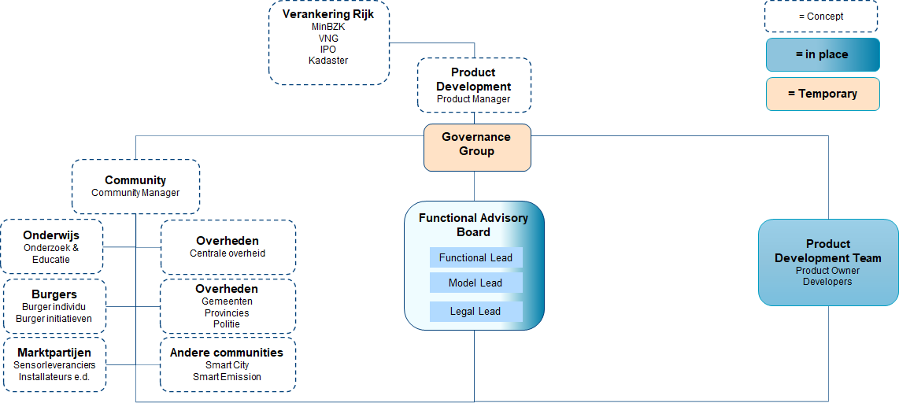

# Functional Advisory Board (FAB)

_(Dutch only for now)_ | [link to notes / notulen](../notes)

De Functional Advisory Board bestaat uit een vertegenwoordiging van de stakeholders (community) en houdt zich bezig met het maken van functionele, juridische en data modelleringkeuzes gedurende de looptijd van het project. De ProductOwner (PO) treedt op als voorzitter (indien noodzakelijk met assistentie) en agendeert de inhoud van de komende sprint. Indien opportuun participeren leden van het realisatieteam. De FAB komt 2-wekelijks samen.  

Deelnemers worden beschouwd als inhoudelijke adviseurs. Als adviseur denk en discussieer je mee over de functionaliteit, datamodellering en juridische aspecten van het sensorenregister die mede de invulling vormen van de door de PO geagendeerde epics en user stories.

Een adviseur heeft affiniteit met de (gemeentelijke, maar ook bredere) uitvoeringspraktijk en behoeftes rondom de registratie en informatieverstrekking van sensoren. 

Bovenstaande organigram is in wording en nog niet gerealiseerd. Wel is de FAB in beperkte vorm opgezet om input voor het Product Development Team te kunnen leveren om een MVP te kunnen ontwikkelen. In beperkte vorm aangezien er nog geen grotere 'kapstok' is om een FAB in bovenstaande hoedanigheid te positioneren. De FAB die gestart is levert met name directe input aan het Product Development Team en heeft de potentie om uit te groeien tot het orgaan dat richting en inhoud bepaalt en besluiten neemt over het geheel. We zijn onderweg naar morgen ;-)
