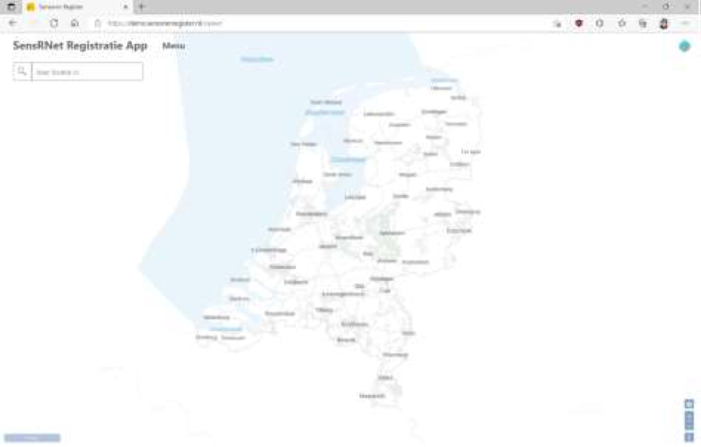
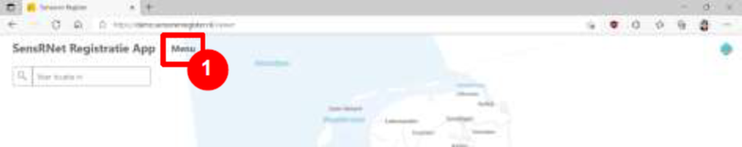
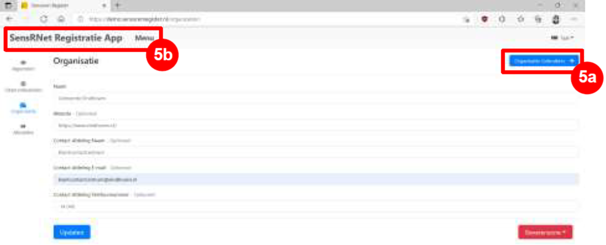
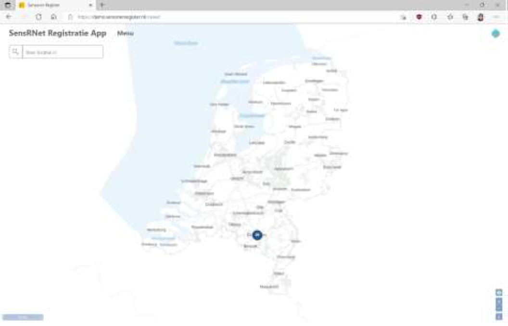
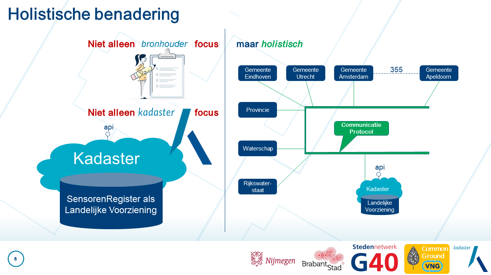
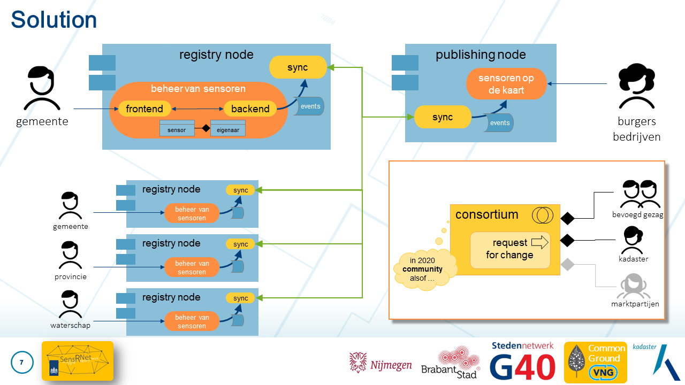

# Handleiding Beheerders SensRNet (Concept)

> _Hoe beheer je apparaten, sensoren, en datastromen in het sensorenregister (SensRNet)? Deze handleiding is bedoeld om beheerders van sensoren te ondersteunen bij het opvoeren, updaten en verwijderen van gegevens in SensRNet._

> _LET OP: dit betreft dus niet per definitie alle functionaliteiten van de tool en de API, puur de onderdelen relevant voor het beheer van de vakinhoudelijke gegevens. 
Meer informatie over SensRNet lees je [hier](https://kadaster-labs.github.io/sensrnet-home/)._

> _De initiële versie van dit document is gemaakt door de [gemeente Eindhoven](https://www.eindhoven.nl/). Opmerkingen of vragen over deze handleiding? Mail data@eindhoven.nl._

> _LET OP: dit is een CONCEPT document dat zal worden aangevuld op basis van de resultaten van de [pilots](https://kadaster-labs.github.io/sensrnet-home/Pilots/)._ 

Inhoudsopgave
- In de tool
- Lid worden van de organisatie (eenmalige actie)
- Gegevens opvoeren met de tool
- Observatiedoelen
- Gegevens bewerken met de tool
- Observatiedoelen
- Gegevens verwijderen met de tool
- Observatiedoelen
- Met de API
- Access token
- Basis URL
- Gegevens opvoeren met de API
- Mogelijke methodiek 1:n opvoer gegevens
- Instructie gebruik FME script opvoer gegevens
- Gebruikte URL’s voor opvoer gegevens
- Gegevens bewerken met de API
- Gebruikte URL’s voor bewerken gegevens
- Gegevens verwijderen met de API
- Methodiek verwijderen gegevens
- Instructie gebruik FME script verwijderen gegevens
- Gebruikte URL’s voor verwijderen gegevens
- Overige opties API
- Resultaat

## In de tool

Dit is de applicatie van het sensorenregister (SensRNet):

#### Lid worden van de organisatie (eenmalige actie)

Binnen de applicatie dien je eerst onderdeel te worden van een organisatie.
Je doet dit door op “Menu” te klikken linksboven op de pagina (1).

Vervolgens klik je op “Organisatie” (2), vink je de gewenste organisatie aan (3), en klik je op “Toetreden” (4).

Je krijgt na het toetreden een scherm te zien met details over jouw organisatie:

Onder “Organisatie Gebruikers” (5a) kan je controleren of je in de lijst met gebruikers van jouw organisatie staat. 
Om terug te gaan naar de homepage, klik je op “SensRNet Registratie App” of op “Menu” linksboven op de pagina (5b). Vervolgens zie je de sensoren van jouw organisatie op de kaart:

Deze architectuur is gebaseerd op een aantal [Key Concepts](KeyConcepts.md).

De architectuur van SensRNet heeft een holistische benadering van het beheer van sensoren op nationaal niveau:

De 'solution' is dan ook een netwerk van deelnemers, nodes in een netwerk, waarin elk bevoegd gezag een node is met eigen applicatie en infrastructuur om het beheer van sensoren uit te voeren. Onderdeel van die infrastructuur is het standaard [Component Sync](#component-sync) dat er voor zorgt dat data gedeeld wordt in het netwerk, met alle andere nodes.

## Walking skeleton

De realisatie van het SensRNet, het Nederlandse nationale sensorenregister, wordt in stappen, plateaus aangepakt. Daarbij wordt getracht zoveel mogelijk hergebruik te doen van bestaande software en systemen en is de uitvoering gericht op samenwerking. Zo wordt eerst de focus gelegd op het aantonen van het totaal in een 'zeer dunne uitvoering', een zogenaamde ['walking skeleton'](https://wiki.c2.com/?WalkingSkeleton).

## Componenten

SensRNet bestaat uit een aantal componenten:

1. Registry Graphical User Interface (GUI) / frontend / webapp
1. Registry backend
1. Sync
1. Centrale voorziening van alle sensoren op de kaart / centrale viewer

In een 'Registry Node' worden de componenten 1 en 2 uitgevoerd en component 4 bevindt zich alleen in de centrale voorziening. Component 3 draait in elke node en voorziet in de synchronisatie van data en directe koppelingen tussen alle nodes.

### Component Registry

Het beheer van sensoren, de 'registry', bestaat uit twee componenten die nauw samenwerken: een frontend en backend. De backend biedt APIs aan de frontend. Voor de (geo-services) WMS/WFS is een aparte server aan dezelfde database gekoppeld.

Er kunnen meerdere varianten bestaan voor de verschillende componenten voor de verschillende behoeftes van de diverse bevoegde gezagen.

Voor de basis van en/of als voorbeeld van deze twee componenten, wordt gekeken naar:

1. [Slimme apparaten](https://slimmeapparaten.amsterdam.nl/) van [Gemeente Amsterdam](https://www.amsterdam.nl/) (en ook [Persoonsgegevensverwerking in de openbare ruimte](https://maps.amsterdam.nl/privacy/))
1. [SensorPilot](https://www.binnenlandsbestuur.nl/ruimte-en-milieu/kennispartners/kadaster/wat-kan-en-mag-met-sensoren-in-de-openbare-ruimte.9601501.lynkx), uitgevoerd PoC in 2018 door [Gemeente Eindhoven](https://www.eindhoven.nl/) en [Kadaster](https://www.kadaster.nl/)

### Component Sync

**Sync** is de synchronisatie van alle 'shared data' in het netwerk. Daarnaast biedt deze component APIs voor directe calls tussen specifieke nodes.

1. **Synchronisatie van events van elke node met alle nodes**
   
   Events zijn de ‘**core API**’ in het netwerk; alle ‘**shared data**’ is gemodelleerd als events. De huidige situatie kan worden afgeleid door alle events ‘af te spelen’ tot nu. Alle events vormen samen de sensorenregistratie in het netwerk. Dit heeft grote overeenkomsten met een ‘event store’ in een event-sourced systeem of transacties in een distributed ledger (DLT/blockchain). Volgorde van ontstaan en het **samenvoegen van de events** vanuit de verschillende nodes is onderdeel van de functionaliteit.
   
   Events zijn (oa) `EigenaarGeregistreerd`, `SensorToegevoegd`, `SensorVerwijderd`, `SensorInfoGewijzigd`, `SensorVerplaatst` (geo-locatie) voor de sensorenregistratie, maar mogelijk ook ‘netwerk administratie’ events als `NodeToegevoegd`, `NodeVerwijderd`, `NodeAdresGewijzigd`.

   **implementatie**: [MultiChain](SyncMultiChainEN.md)

1. **Directe API calls voor specifieke acties voor of data van een specifieke node**

   Voor extra informatie over een bepaalde sensor of eigenaar, kan een specifieke API aangeroepen worden op de node waar die sensor of eigenaar geregistreerd is. Voor de functionaliteit ‘_contact opnemen met eigenaar_’ wordt het bericht naar de node gestuurd – via een API call op die node – waar meer (private) details bekend zijn van de eigenaar van de betreffende sensor.

## Environments

Een omgeving (environment) bestaat uit meerdere containers die samen een node vormen.
Om deze in samenhang te kunnen draaien en om de operatie (Operations) gemakkelijk te maken, is gebruik van [Kubernetes](https://kubernetes.io/) als uitgangspunt genomen voor SensRNet en omgevingen (environments).

Details van de [deployment](Deployment.md) (uitrollen) van de componenten is apart beschreven.

### Test environments

Voor het testen wordt gebruik gemaakt van Kadaster infrastructuur in Azure/KadasterLabs. Daarin worden twee 'Registry nodes' opgezet die twee verschillende gemeenten simuleren. Daarnaast natuurlijk de 'Publishing node' die standaard bij Kadaster blijft draaien.

