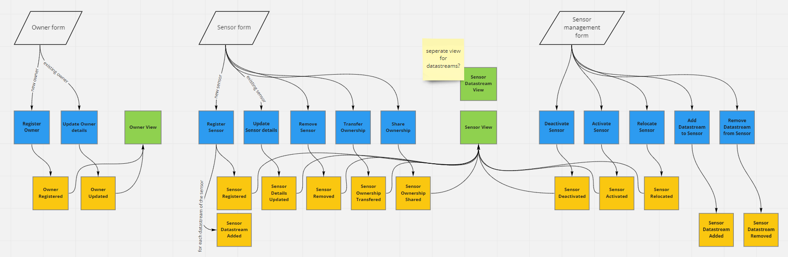
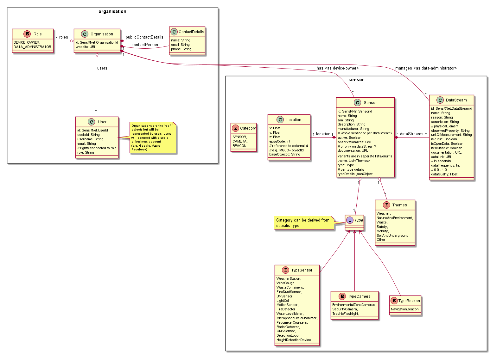

# Model

About the modeling of the information, the data you could have many discussions. 
At this stage we would like to set up a system which has the capability to be changed and extended. 
That's the first 'must have'. 
Secondly, we try to start with a most sensible model to have a decent start without the need to change this many times from the start. 
Therefor we take into account several official and de facto standards:

- [SensorThingAPI](https://en.wikipedia.org/wiki/SensorThings_API)
- [Open Urban Platform]()
- [SmartM2M](https://www.etsi.org/committee/smartm2m)
- [Slimme apparaten van Amsterdam](https://slimmeapparaten.amsterdam.nl/) (sources: [frontend](https://github.com/Amsterdam/register-slimme-apparaten-frontend) and [backend](https://github.com/Amsterdam/iot-api))
- [SensorPilot](https://www.binnenlandsbestuur.nl/ruimte-en-milieu/kennispartners/kadaster/wat-kan-en-mag-met-sensoren-in-de-openbare-ruimte.9601501.lynkx)

The [**SensorPilot**](SensorPilot.md) of 2018 was already a start with these in mind. 
So we take this as a quick start. 
Missing in all models are the actions or so called 'Commands' and the Events. 
What kind of actions, commands can be executed (called) at a resource like Owner and Sensor? 
In our first event-storming session we came up with this [event modeling](https://eventmodeling.org/) diagram:



## Views

The views in the event modeling above contains of two main parts: Owner and Sensor.
The UML model of these parts is based on the [SensorPilot](SensorPilot.md) model and the [SensorThingAPI](https://en.wikipedia.org/wiki/SensorThings_API)




This needs to be complemented with 'recipies' of sensible and possible combinations of values. For example, a temperature data stream has options for _unitOfMeasurement_ between `Degree Celcius` and `Degree Farenheit`, not `percentage CO2`.

## Events

Events are the 'core APIs' of the system, of SensRNet. 
There are differences between the events in the Registry (_'Beheer van Sensoren'_) and in the Network (Sync).

| Registry events         | Network events                                |
|-------------------------|-----------------------------------------------|
| public and private data | public data _only_ (and keys of private data) |
| -                       | extra fields: `NodeID`                        |

The fields in both events are the same (for a start and maintained as such as far as possible). 
At this stage there's no code to point to yet, so events are only documented for now:

**Owner aggregate**

```ts
class OwnerRegistered {
    ownerId: SensRNetOwnerId; // aggregate key
    nodeId: SensRNetNodeId; // network events only
    email: string;
    publicName: string;
    name: string;
    companyName: string;
    website: URL;
    ssoId: string; // (GoogleID, OpenID, FacebookID, AzureID, etc)
}
```

```ts
class OwnerUpdated {
    // same as OwnerRegistered although the ownerId (and nodeId) never change
}
```

**SensorAggregate**

```ts
class SensorRegistered {
    sensorId: SensRNetSensorId; // aggregate key
    nodeId: SensRNetNodeId; // network events only
    owner: SensRNetOwnerId;
    location: {
        lon: number;
        lat: number;
        height: number;
        baseObjectId: IMGEO++ id; // or something like this
    };
    legalBase: string; // the reason why this sensor is there
    typeDetails: object; // json object with specific details for this type of sensor; model might be specified later
}
```

```ts
class SensorDetailsUpdated {
    // same as SensorRegistered although the sensorId (and nodeId) never change
}
```

```ts
class SensorRemoved {
    sensorId: SensRNetSensorId; // aggregate key
    nodeId: SensRNetNodeId; // network events only
    comments: string; // optional reason for removal
}
```

```ts
class SensorOwnershipTransfered {
    sensorId: SensRNetSensorId; // aggregate key
    nodeId: SensRNetNodeId; // network events only
    newOwner: SensRNetOwnerId;
}
```

```ts
class SensorOwnershipShared {
    sensorId: SensRNetSensorId; // aggregate key
    nodeId: SensRNetNodeId; // network events only
    newOwner: SensRNetOwnerId;
}
```

```ts
class SensorDeactivated {
    sensorId: SensRNetSensorId; // aggregate key
    nodeId: SensRNetNodeId; // network events only
    comments: string; // optional reason for deactivation
}
```

```ts
class SensorActivated {
    sensorId: SensRNetSensorId; // aggregate key
    nodeId: SensRNetNodeId; // network events only
    comments: string; // optional reason for activation
}
```

```ts
class SensorRelocated {
    sensorId: SensRNetSensorId; // aggregate key
    nodeId: SensRNetNodeId; // network events only
    owner: SensRNetOwnerId;
    location: {
        lon: number;
        lat: number;
        height: number;
        baseObjectId: IMGEO++ id; // or something like this
    };
    legalBase: string; // the reason why this sensor is there
    comments: string; // optional reason for relocation
}
```

```ts
class SensorDatastreamAdded {
    datastreamId: SensRNetDatastreamId;
    sensorsensorId: SensRNetSensorId; // aggregate key
    nodeId: SensRNetNodeId; // network events only
    type: string; // needs be more specific?
    dataUrl: URL; // link to data API
}
```

```ts
class SensorDatastreamRemoved {
    // ...
}
```

