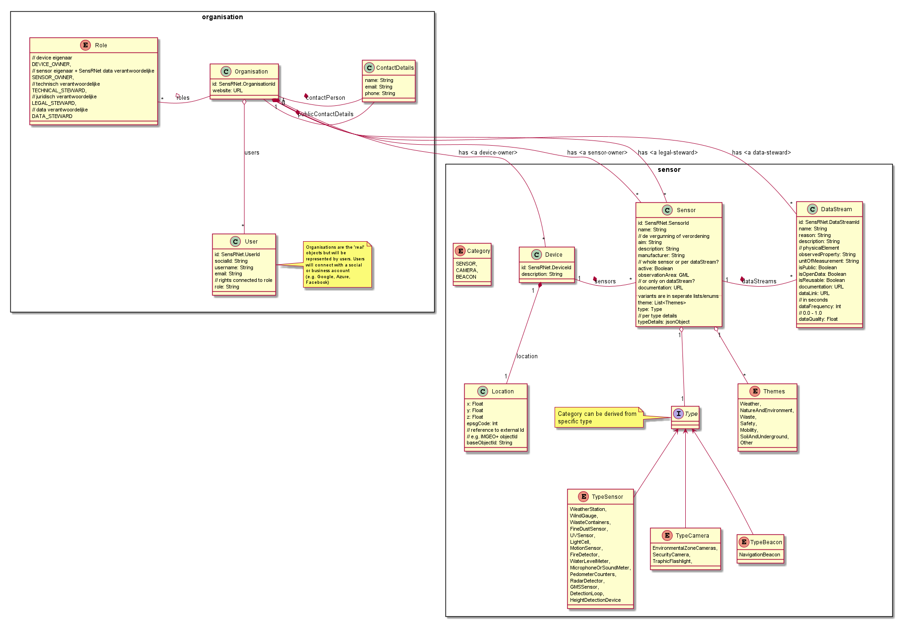

# Model

About the modeling of the information, the data you could have many discussions. 
At this stage we would like to set up a system which has the capability to be changed and extended. 
That's the first 'must have'. 
Secondly, we try to start with a most sensible model to have a decent start without the need to change this many times from the start. 
Therefor we take into account several official and de facto standards:

- [SensorThingAPI](https://en.wikipedia.org/wiki/SensorThings_API)
- [Open Urban Platform]()
- [SmartM2M](https://www.etsi.org/committee/smartm2m)
- [Slimme apparaten van Amsterdam](https://slimmeapparaten.amsterdam.nl/) (sources: [frontend](https://github.com/Amsterdam/register-slimme-apparaten-frontend) and [backend](https://github.com/Amsterdam/iot-api))
- [SensorPilot](https://www.binnenlandsbestuur.nl/ruimte-en-milieu/kennispartners/kadaster/wat-kan-en-mag-met-sensoren-in-de-openbare-ruimte.9601501.lynkx)

Also have a look at:

- [Rapport Geonovum - Op weg naar een Sensorverordening 2018](Rapport-Op-weg-naar-een-Sensorverordening-eindversie-201218.pdf) (pdf)
- [Verkenning Making Sense for Society (MS4S) - Sensoren en Semantiek 2.0](Verkenning-MS4S-SensorenEnSemantiek-2.0.pdf) (pdf)

The [**SensorPilot**](SensorPilot.md) of 2018 was already a start with these in mind. 
So we take this as a quick start. 
Missing in all models are the actions or so called 'Commands' and the Events. 
What kind of actions, commands can be executed (called) at a resource like Owner and Sensor? 
In our first event-storming session we came up with this [event modeling](https://eventmodeling.org/) diagram:

'Walking skeleton' version:

Latest version (dd 2020, Nov 2nd):

## Definitions

- **Sensor**
  
  > EN: ..

  > NL: Een sensor is een kunstmatig zintuig dat de omgeving waarneemt en de kenmerken daarvan meet. Ze bestaan in verschillende verschijningsvormen: een thermometer die temperatuur meet, een camera die passanten op een brug telt of een infraroodsensor die kan detecteren of een parkeerplaats bezet is of niet. Via een internetverbinding sturen deze sensoren data door die vervolgens gebruikt kunnen worden om analyses uit te voeren, real time dashboards te maken, of (geautomatiseerde) acties te laten volgen.

- **Datastream**
  
  > EN: ..

  > NL: ..

## Views

The views in the event modeling above contains of two main parts: Owner and Sensor.
The UML model of these parts is based on the [SensorPilot](SensorPilot.md) model and the [SensorThingAPI](https://en.wikipedia.org/wiki/SensorThings_API)

This needs to be complemented with 'recipies' of sensible and possible combinations of values. For example, a temperature data stream has options for _unitOfMeasurement_ between `Degree Celcius` and `Degree Farenheit`, not `percentage CO2`.

## Events

Events are the 'core APIs' of the system, of SensRNet. 
There are differences between the events in the Registry (_'Beheer van Sensoren'_) and in the Network (Sync).

| Registry events         | Network events                                |
|-------------------------|-----------------------------------------------|
| public and private data | public data _only_ (and keys of private data) |
| -                       | extra fields: `NodeID`                        |

The fields in both events are the same (for a start and maintained as such as far as possible). 

The events in the Registry Backend are modelled like this:

