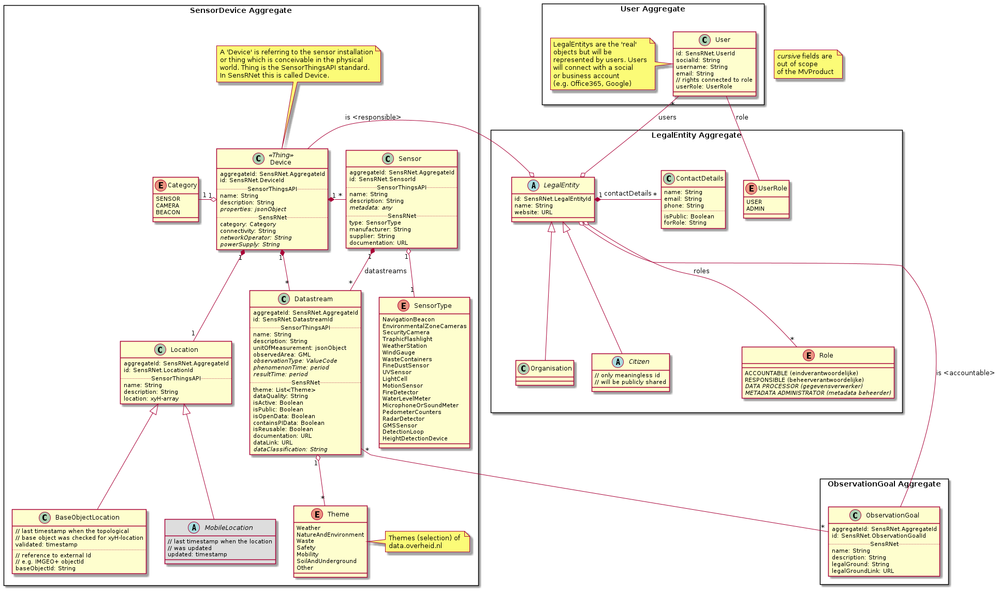
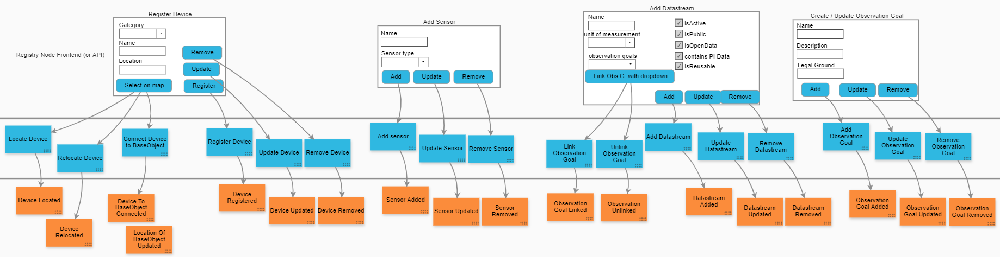

# Model

The SensRNet datamodel is about the metadata of sensors.
The definition of 'sensor' is interesting in itself, because of the general notion of a sensor versus the sensor as the sensing hardware.
Technically the sensing hardware is the actual sensor which transforms a pyhisical element into electronic output.
But because this can be very diverse and complex, the general conception of 'the sensor' is 'the thing' we can see, we hold in our hands.

So on one hand there's the object we conveive in the physical world. On the other hand there's the data coming out of this 'box'.
The stream of raw data of the observations, the values of the measurements.
This can be indicated as 'datastream' and could be described as the general conception of the sensor in 'the digital world'. On top of these conceptions the datamodel links the 'governmental world' to the sensor (aggregate) and datastreams with the goal and the legal decision which form the legal ground on why these measurements are allowed to take place (see also [Datamodel Explained.pptx](SensRNet-Datamodel-explained.pptx))

## Definitions

The definitions are put in a seperate table (in reStructuredText format): [Definitions](Definitions.rst)

## Views

The views in the event modeling above consists of two main parts: Owner (or more formal: Legal Entity) and Sensor.
The UML model of these parts is based on the [SensorPilot](SensorPilot.md) model and the [SensorThingsAPI](https://en.wikipedia.org/wiki/SensorThings_API)

A few notes to concern about this model:

- A Device is the object of choice to register as the 'container' or 'the box' or 'the installation' you would like to register. The general guideline for this is:
  
  > If the primary goal of a topological object is sensing then it might be the Device to register in SensRNet (e.g. an integrated smart lamppost). If it's primary goal is NOT sensing but something else and it also supports (integrated or non-integrated) sensors it is considered a plain topological object (in BGT for example) and is referenced in the location of the Device registered in SensRNet.

- The location of a Device in SensRNet is always at the given and registered xyH-array location. Of course this can be derived from the `baseObjectId` in (for example) BGT, but this is an explicit action by the user. No automated correction are being made when the location in BGT changes (of the referenced object). This is because the location of the sensor might be slightly different although still connected to the topological base object. This can not be derived automatically.

- In addition to this during usage of SensRNet the datamodel might be complemented with 'recipies' of sensible and possible combinations of values. For example, a temperature data stream has options for _unitOfMeasurement_ between `Degree Celcius` and `Degree Farenheit`, not `percentage CO2`. Or maybe even 'recipies' of known devices available on the market. This will evolve over time and after the MVP has been released. (i.o.w. out of scope of the MVP ;-)

## Events

Missing in all models are the actions or so called 'Commands' and the Events. 
What kind of actions, commands can be executed (called) at a resource like Owner and Sensor? 
What reasons are there to change the information?
What is the granularity of these changes?

For more info about events see [event modeling](https://eventmodeling.org/)

Events are the 'core APIs' of the system, of SensRNet. 
There are differences between the events in the Registry Nodes (_'Beheer van Sensoren'_) and in the Network (Sync).

| Registry events         | Network events                                |
|-------------------------|-----------------------------------------------|
| public and private data | public data _only_ (and keys of private data) |
| -                       | extra fields: `NodeID`                        |

The fields in both events are the same (for a start and maintained as such as far as possible). 

The events in the Registry Backend are modelled like this:

## Event Storming

In our first event-storming session we came up with this [event modeling](https://eventmodeling.org/) diagram:

'Walking skeleton' version:

Latest version (dd 2021, Feb 26th):

## Background & Standards

For the different contexts the datamodel follows as much as possible (open) standards.
The main standard is the **SensorThingsAPI**.

- [SensorThingsAPI](https://en.wikipedia.org/wiki/SensorThings_API)
- [Open Urban Platform]()
- [SmartM2M](https://www.etsi.org/committee/smartm2m)
- [Slimme apparaten van Amsterdam](https://slimmeapparaten.amsterdam.nl/) (sources: [frontend](https://github.com/Amsterdam/register-slimme-apparaten-frontend) and [backend](https://github.com/Amsterdam/iot-api))
- [SensorPilot](SensorPilot.md)

Also have a look at:

- [Rapport Geonovum - Op weg naar een Sensorverordening 2018](Rapport-Op-weg-naar-een-Sensorverordening-eindversie-201218.pdf) (pdf)
- [Verkenning Making Sense for Society (MS4S) - Sensoren en Semantiek 2.0](Verkenning-MS4S-SensorenEnSemantiek-2.0.pdf) (pdf)

