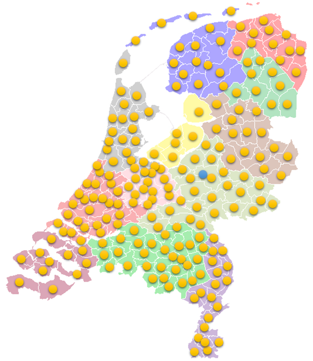
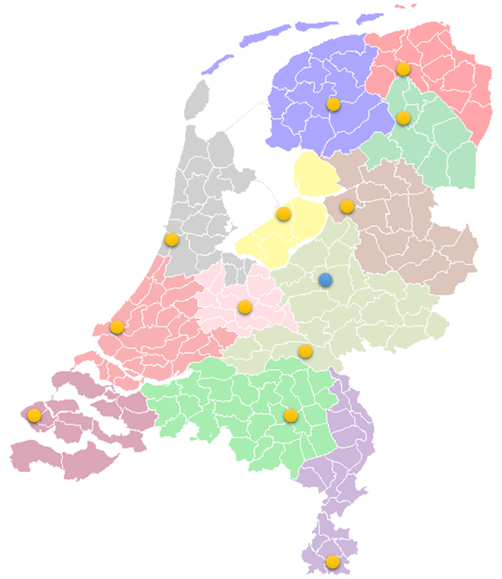

# Network

SensRNet is build on the [Key Concept](KeyConcepts.md) 'Decentralization as given'.
This is applied as a decentral [architecture](Architecture.md) based on a distributed ledger (technology underneath [blockchain](Blockchain.md)).
The architecture designs a network of connected nodes, Registry Nodes, which interact and share data.
This is very flexible and scalable and does not design a fixed set up of nodes.
There are actually multiple options, open for development and evolution of the network:

1. 1 node per municipality -> ca. 350+ nodes
1. 1 node per department per municipality -> ca. 1000+ nodes
1. 1 node per province -> ca. 12+ nodes
1. 1 node per province + 1 node per (huge) city -> ca. 20+ nodes
1. any mix -> between 12 and 2000 nodes
1. <s>Centraal -> 2 nodes (mutation + information side)</s> _(even a central set up is technically possible but against the key concept of decentralization as given)_

| Network set up 1 node per municipality     | Network set up 1 node per province     |
|--------------------------------------------|----------------------------------------|
|  |  |
