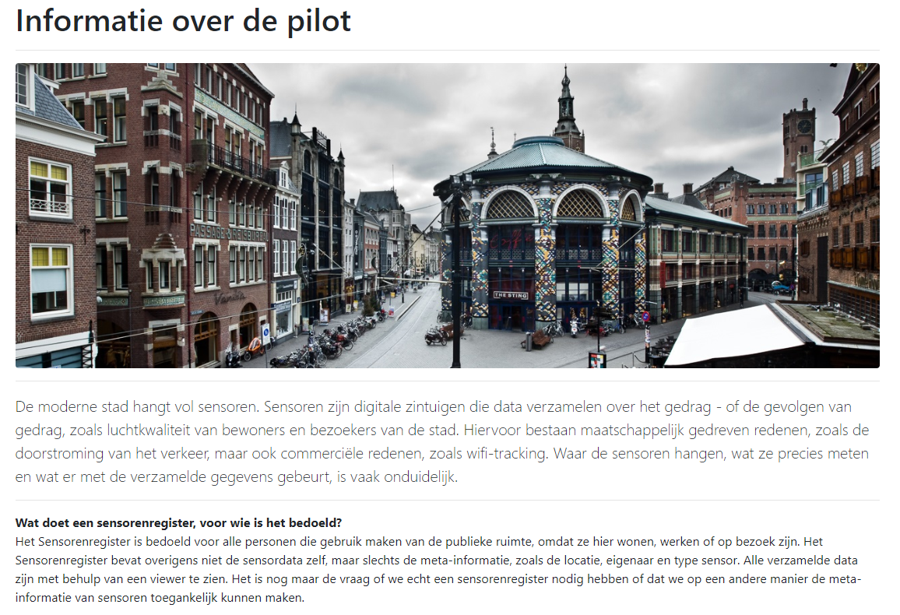
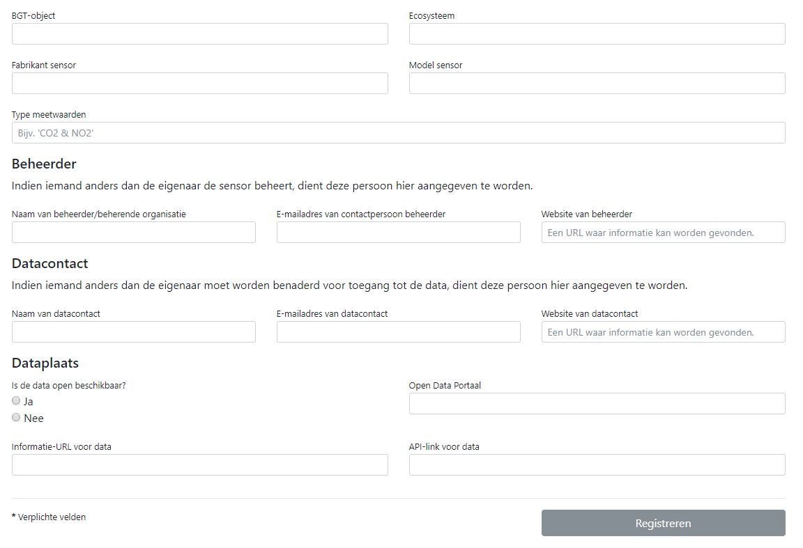
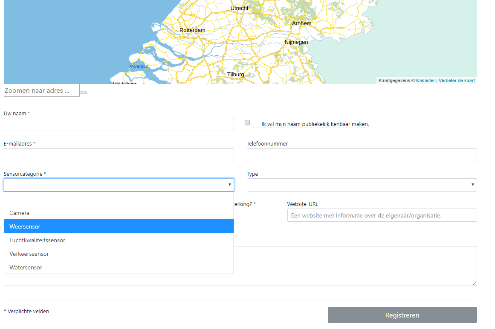
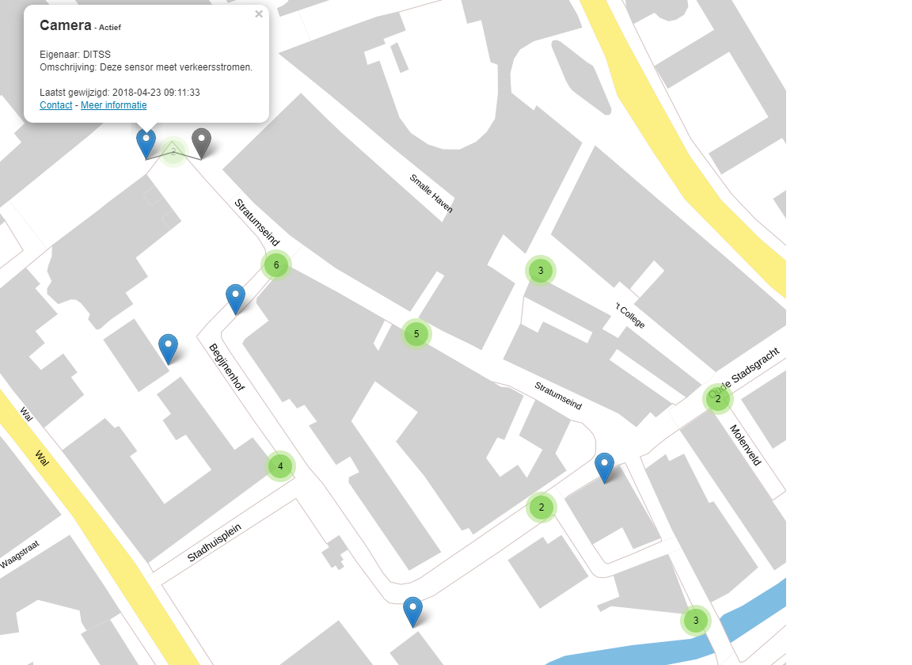
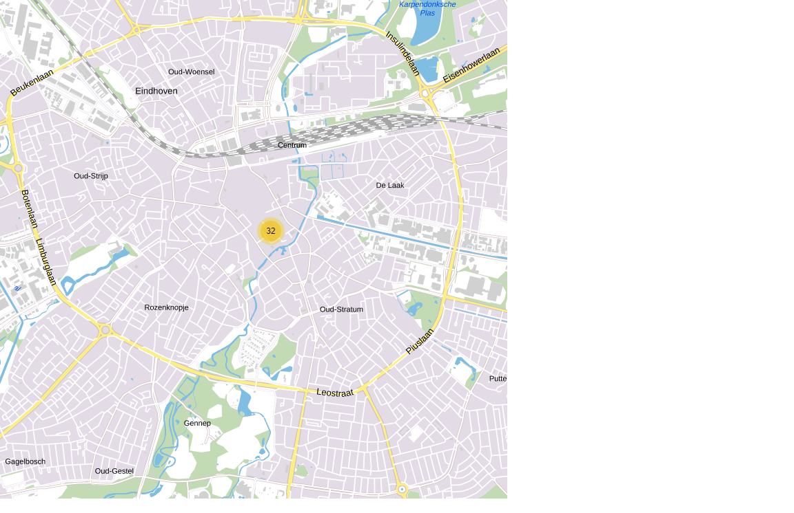
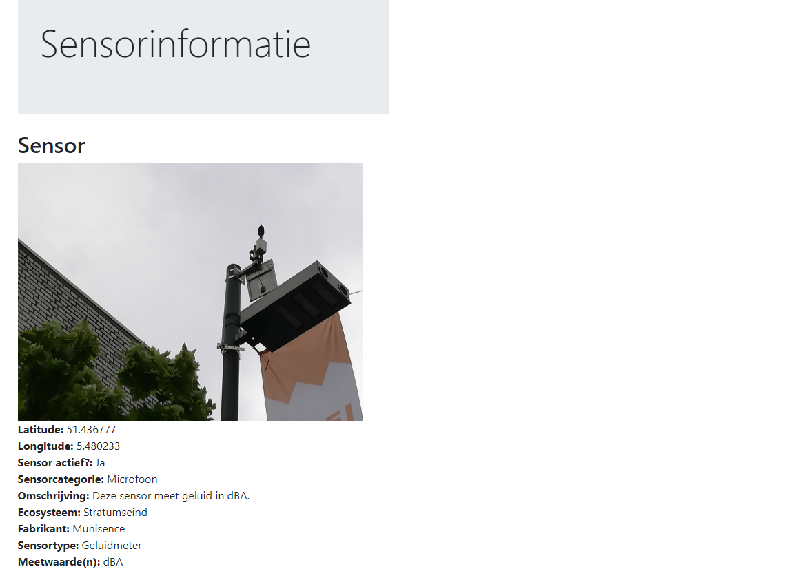

# SensorPilot

The **[SensorPilot](https://www.binnenlandsbestuur.nl/ruimte-en-milieu/kennispartners/kadaster/wat-kan-en-mag-met-sensoren-in-de-openbare-ruimte.9601501.lynkx)** was the pilot in 2018 by Gemeente Eindhoven and Kadaster to explore how a National Sensor Registry could look like.

Below are the screenshots of the Proof of Concept that was developed at that time.

_(credits to ??)_

