# SensRNet Registry Node gebruikershandleiding

> _Hoe beheer je apparaten, sensoren, en datastromen in het sensorenregister. Deze handleiding is bedoeld om beheerders van sensoren te ondersteunen bij het opvoeren, bewerken en verwijderen van gegevens in een SensRNet Registry Node._
>
> _Met dank aan de [gemeente Eindhoven](https://www.eindhoven.nl/) voor de eerste opzet van deze handleiding. Feedback en/of verbeteringen zijn altijd welkom. Zie onze [SensRNet Contribution Guide](https://github.com/kadaster-labs/sensrnet-home/blob/main/CONTRIBUTING.md)_ 

## Sensoren

Een sensor is een instrument voor de meting van een fysieke eigenschap (bijv. temperatuur, licht, druk, elektriciteit) en is gemonteerd in een apparaat (device).
Om een device te registreren is het nodig eerst een apparaat te registreren.
Definities van de invulvelden vind je op de pagina met [Definities](https://github.com/kadaster-labs/sensrnet-home/blob/main/docs/Definitions.rst), mogelijke keuzes voor de dropdown boxes vind je hieronder bij [Waardelijsten](#waardelijsten).

In het hoofdscherm klik je op Menu, waarna je alle appraten van jouw organisatie ziet.
Om een apparaat toe te voegen, klik je op de button Registreer apparaat.
Je kan vervolgens informatie invullen over het betreffende apparaat.
Je selecteert een locatie door in de kaart te klikken.
Wanneer je alles hebt ingevuld, kun je je apparaat opslaan door te klikken op “Opslaan”.

Om sensoren aan het apparaat te koppelen klik je vanuit dit scherm op Volgende.
In het vervolgscherm klik je op Voeg sensor toe. 
In het volgende scherm kun je gegevens van de sensor invullen.
Voeg alle sensoren toe die bij het apparaat horen en vul de bijbehorende velden in.
Wanneer je alles hebt ingevuld, kun je de sensor(en) opslaan door te klikken op “Opslaan”.

Een datastroom bestaat uit het resultaat van de waarneming door een sensor.
Dit zijn bijvoorbeeld geluidsmetingen, snelheidsmetingen etc.
Om een of meerdere datastromen toe te voegen bij elke sensor, klik je vanuit het invulscherm voor de sensor op “Volgende”.
Klik op “Datastroom toevoegen” bij een sensor naar keuze.
Vul de gegevens van de datastroom in en klik op Opslaan.

## Instructievideo

<iframe width="560" height="315" src="https://www.youtube.com/embed/CvgTUXexfT4" title="YouTube video player" frameborder="0" allow="accelerometer; autoplay; clipboard-write; encrypted-media; gyroscope; picture-in-picture" allowfullscreen></iframe>

## Handmatig

Dit is de applicatie van het sensorenregister (SensRNet):

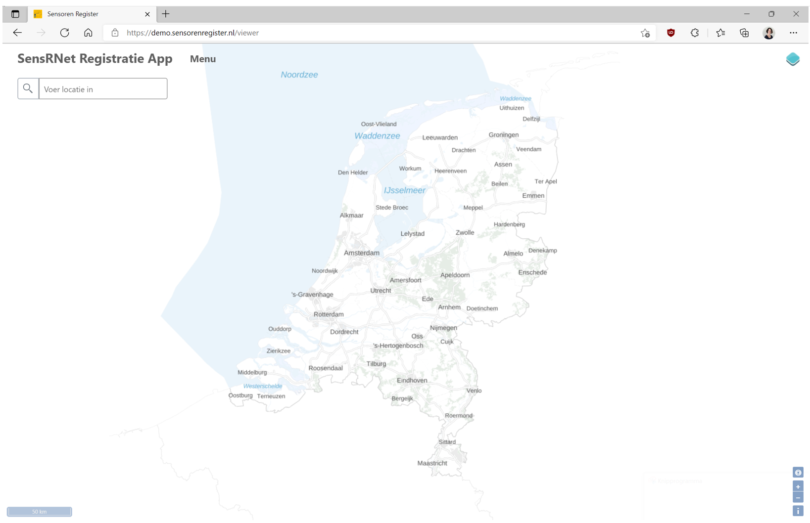

### Lid worden van de organisatie (eenmalige actie)

_Binnen de applicatie dien je eerst onderdeel te worden van een organisatie._

Je doet dit door op “Menu” te klikken linksboven op de pagina (1).

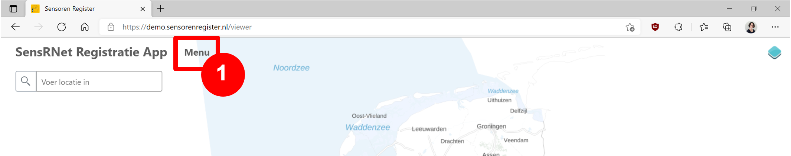

Vervolgens klik je op “Organisatie” (2), vink je de gewenste organisatie aan (3), en klik je op “Toetreden” (4).

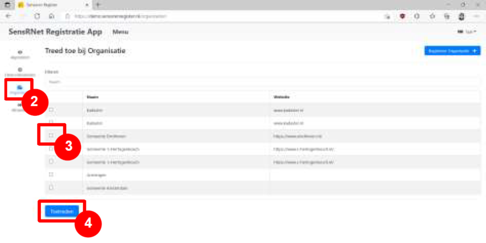

Je krijgt na het toetreden een scherm te zien met details over jouw organisatie:

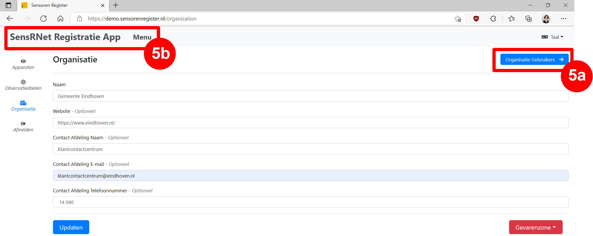

Onder “Organisatie Gebruikers” (5a) kan je controleren of je in de lijst met gebruikers van jouw organisatie staat.
Om terug te gaan naar de homepage, klik je op “SensRNet Registratie App” of op “Menu” linksboven op de pagina (5b). Vervolgens zie je de sensoren van jouw organisatie op de kaart:

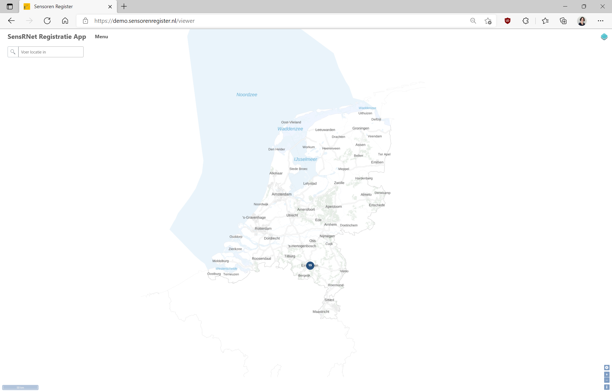

### Gegevens opvoeren

_Binnen het register begin je steeds met het registreren van een apparaat. Dit is een topografisch object waar een of meerdere sensoren aan kunnen hangen. Deze sensoren kunnen elk een of meerdere datastromen hebben, met elk weer een of meerdere observatiedoelen._

Om gegevens op te voeren, klik je op “Menu” linksboven op de pagina (1).

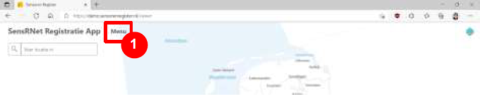

Je komt dan automatisch in een overzicht met de apparaten binnen jouw organisatie:

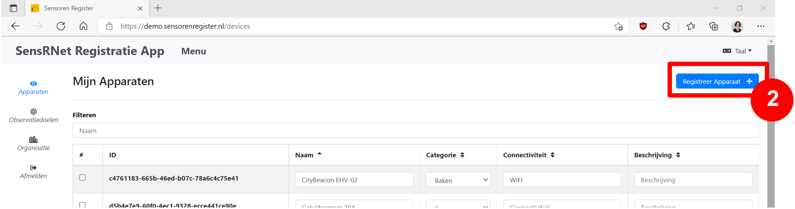

Klik op “Registreer Apparaat” (2).
Je kan vervolgens informatie invullen over het betreffende apparaat. Definities van de velden vind je op [deze pagina](https://github.com/kadaster-labs/sensrnet-home/blob/main/docs/Definitions.rst). Je selecteert een locatie door in de kaart te klikken. Wanneer je alles hebt ingevuld, kun je je apparaat opslaan door te klikken op “Opslaan”.

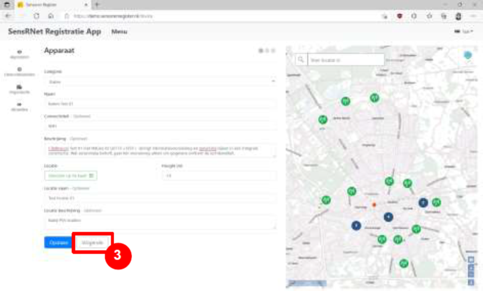

Om sensor(en) toe te voegen bij dit apparaat, klik je op “Volgende” (3).
Klik op “Voeg sensor toe” (4).

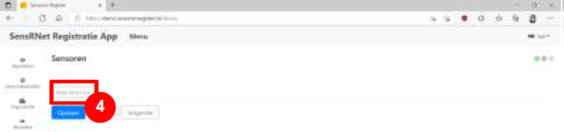

Voeg alle sensoren toe die bij het apparaat horen, en vul de bijbehorende velden in. Wanneer je alles hebt ingevuld, kun je de sensor(en) opslaan door te klikken op “Opslaan”.

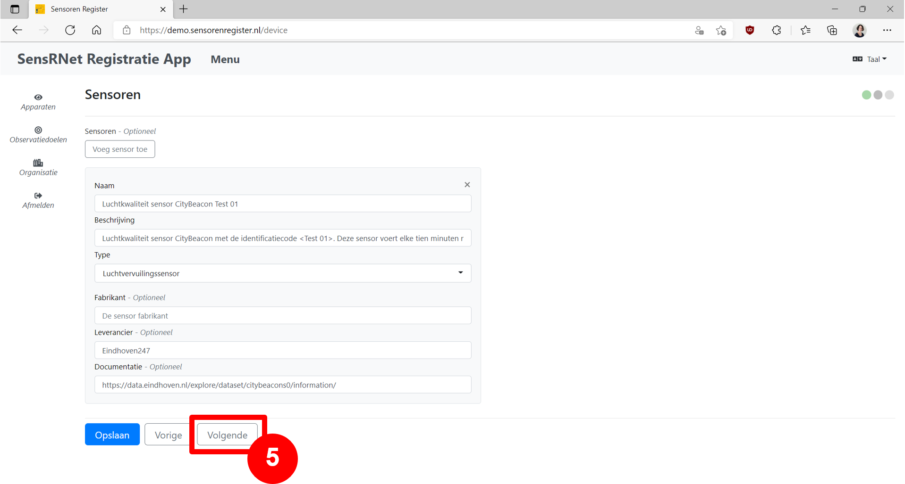

Om een of meerdere datastromen toe te voegen bij elke sensor, klik je op “Volgende” (5).
Klik op “Datastroom toevoegen” bij een sensor naar keuze (6) _(In het voorbeeld zijn er twee sensoren toegevoegd bij één apparaat. Deze kunnen elk weer verschillende datastromen hebben.)_

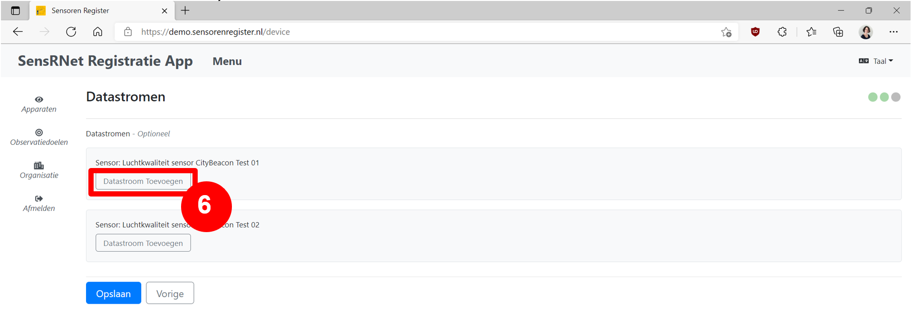

Voeg alle datastromen toe die bij de sensor(en) horen, en vul de bijbehorende velden in. Wanneer je alles hebt ingevuld, kun je de datastroom opslaan door te klikken op “Opslaan” (7).

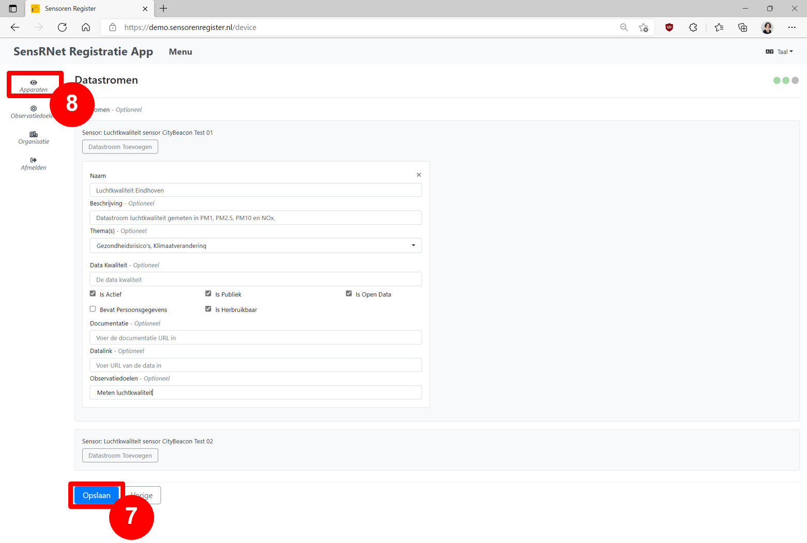

Door op “Vorige” te klikken kan je de velden van het apparaat, sensor(en), en datastroom/datastromen nalopen. Wanneer je op “Apparaten” klikt (8), ga je terug naar het algemene overzicht waar jouw nieuw opgevoerde apparaat nu bovenaan staat:

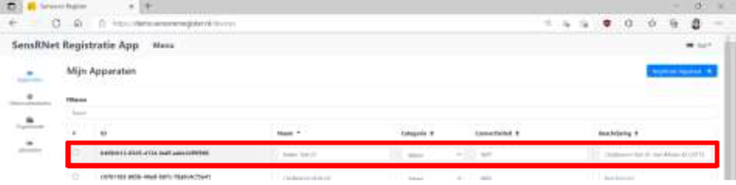

#### Observatiedoelen

_Datastromen kunnen elk een of meerdere observatiedoelen hebben._

Klik in het “Menu” op “Observatiedoelen” (1) om een observatiedoel toe te voegen en/of te koppelen. Je klikt hiervoor op “Registreer Observatie Doel” (2).

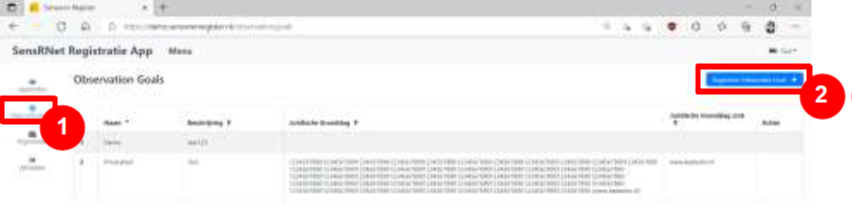

Vul de velden, en klik op “Registreer” (3) om het observatiedoel op te voeren.

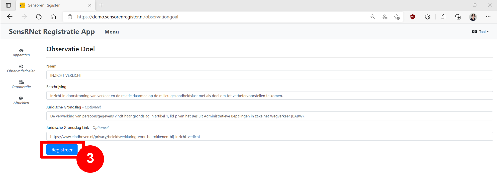

Observatiedoel(en) kan je vervolgens koppelen aan een datastroom.
Hiervoor ga je naar het tabblad “Apparaten” (4). Hier selecteer je het apparaat waaraan je een datastroom wilt koppelen (5), en klik je op “Uitgebreid Bewerken” (6).

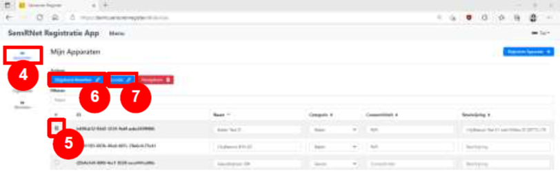

Als alternatief kan je via de kaart (met de knop “Locatie” (7)) ook apparaten selecteren om te bewerken (8).

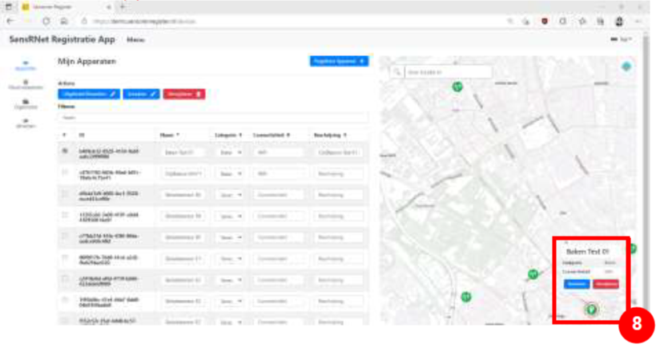

Je komt via “Uitgebreid bewerken” of “Bewerken” uit bij een overzicht met de velden van het apparaat. Klik op “Volgende” (9) voor de bijbehorende sensor(en).

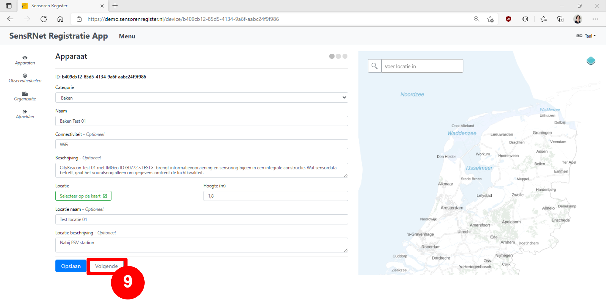

Klik weer op “Volgende” (10) voor de bijbehorende datastroom/datastromen.

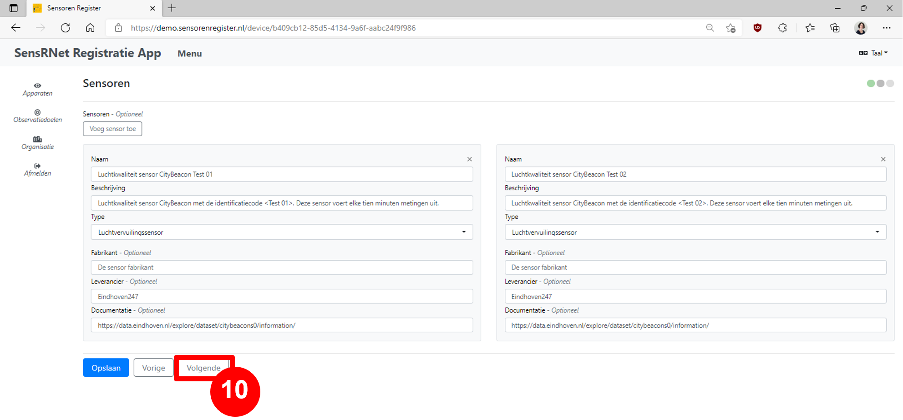

Bij de velden van een datastroom kan je in het attribuut “Observatiedoelen” (11) een of meerdere doelen koppelen uit de lijst. De resultaten sla je op via “Opslaan” (12).

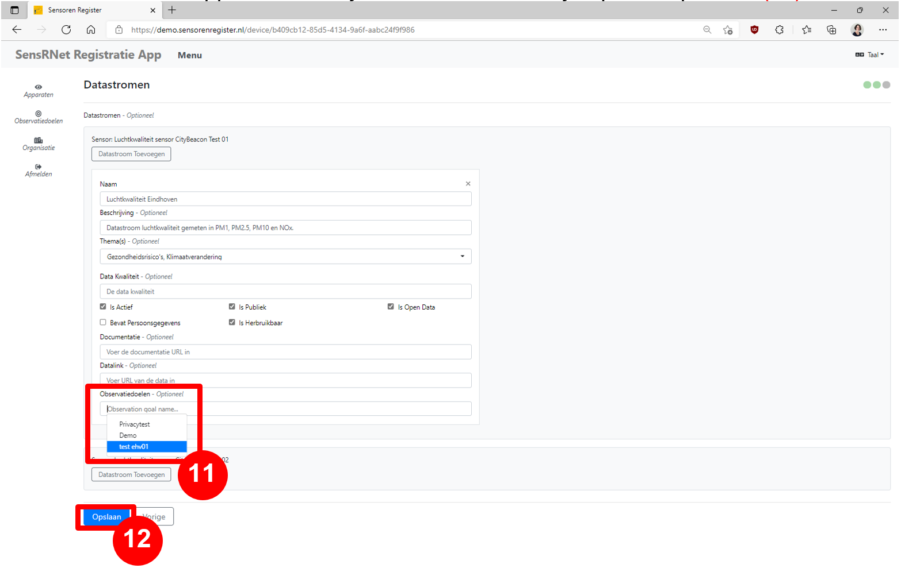

### Gegevens bewerken

Om gegevens te bewerken ga je naar het tabblad “Apparaten” (1). Hier selecteer je het apparaat waar wijzigingen bij nodig zijn (2), en klik je op “Uitgebreid Bewerken” (3).

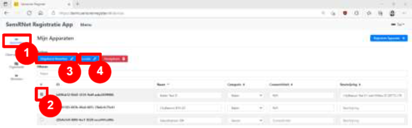

Als alternatief kan je via de kaart (met de knop “Locatie” (4)) ook apparaten selecteren om te bewerken (5).

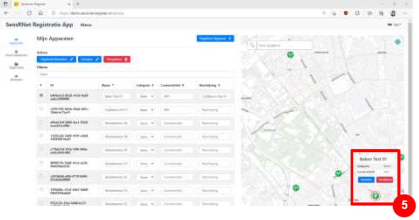

Je komt via “Uitgebreid bewerken” of “Bewerken” uit bij een overzicht met de velden van het apparaat. Deze kan je aanpassen waar nodig. Klik op “Volgende” (6) voor de bijbehorende sensor(en).

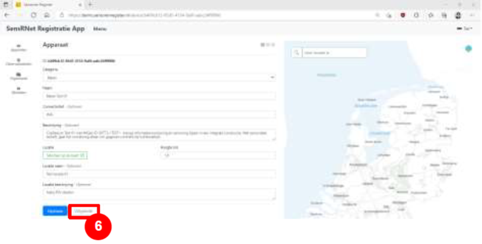

In het overzicht van de sensoren kan je de velden bewerken waar nodig. Klik vervolgens op “Volgende” (7) voor de velden voor de bijbehorende datastroom/datastromen.

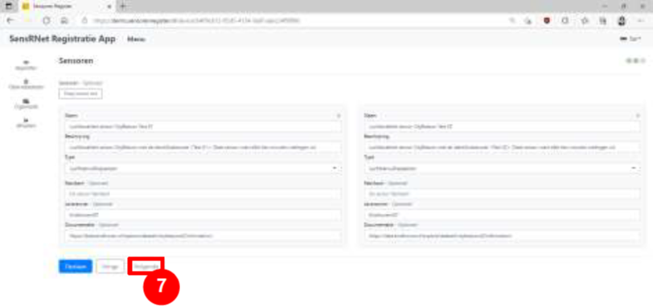

In het overzicht van de datastromen kan je de velden bewerken waar nodig. De resultaten sla je op door te klikken op “Opslaan” (8).

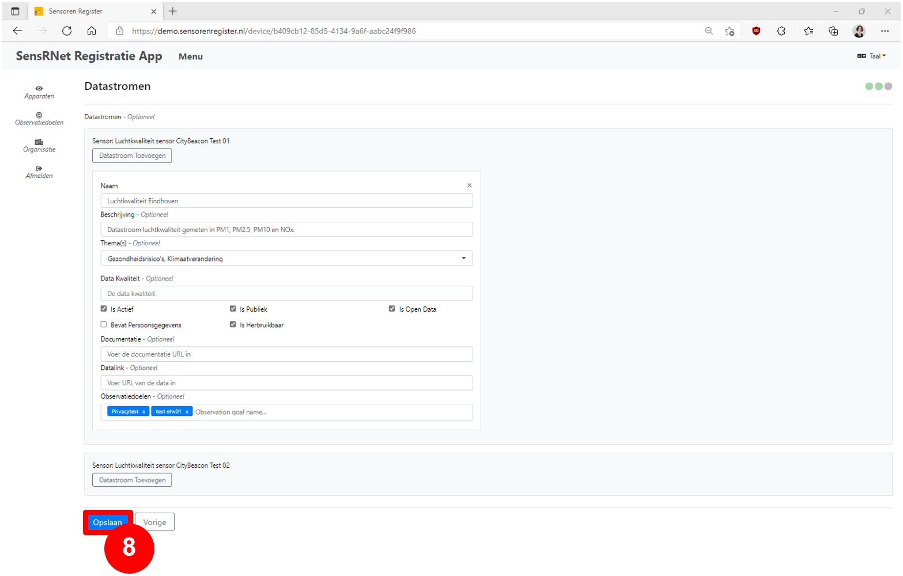

#### Observatiedoelen

Klik in het “Menu” op “Observatiedoelen” (1). Je kan doelen van je eigen organisatie bewerken door op het potloodje te klikken (2).

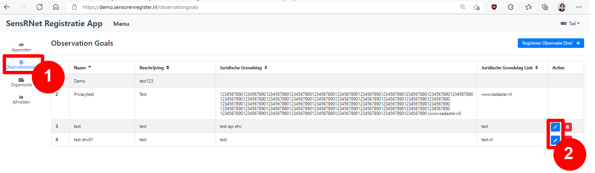

### Gegevens verwijderen

Om gegevens te bewerken ga je naar het tabblad “Apparaten” (1). Hier selecteer je het apparaat waar wijzigingen bij nodig zijn (2). Als je het hele apparaat (inclusief sensoren en datastromen) wilt verwijderen, klik je op “Verwijderen” (3).

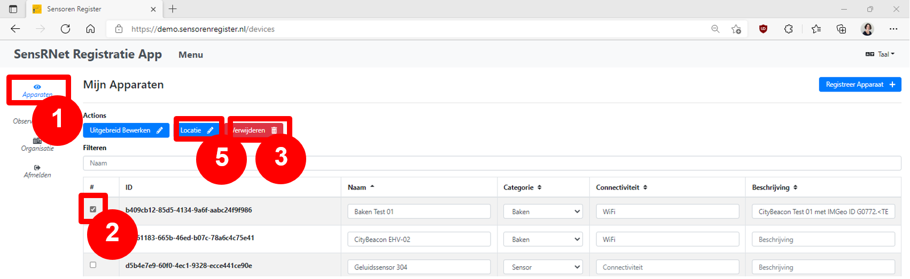

Als alternatief kan je via de kaart (met de knop “Locatie” (5)) ook apparaten selecteren om te verwijderen (6).

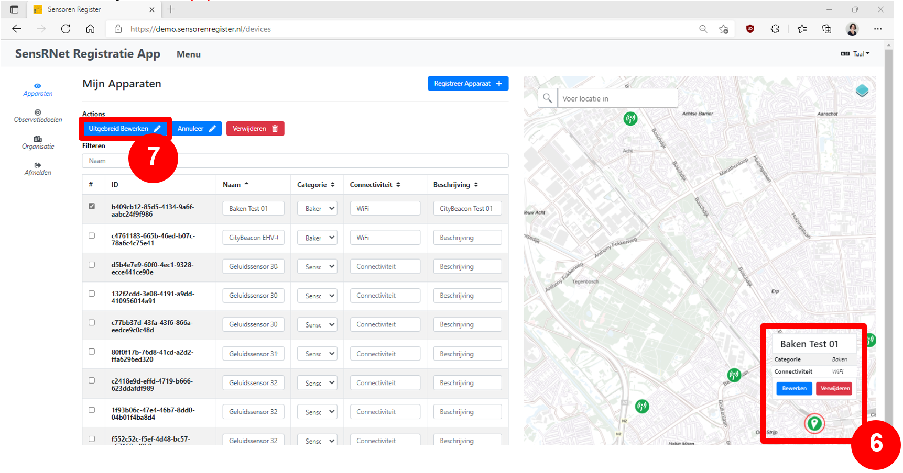

Wil je alleen sensoren of datastromen verwijderen en niet het apparaat, dan kies je voor “Uitgebreid bewerken” (7) of “Bewerken” (6). Je komt dan uit bij een overzicht met de velden van het apparaat. Klik op “Volgende” (8) voor de bijbehorende sensor(en).

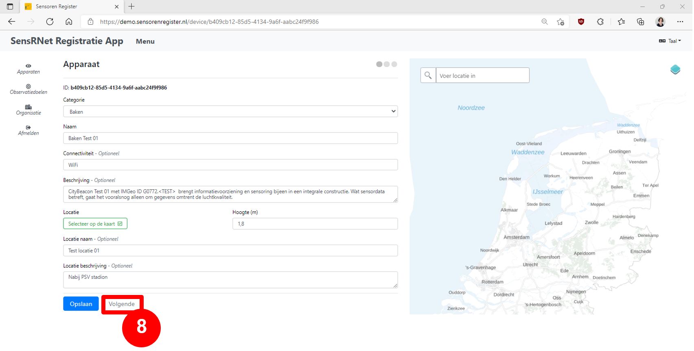

In het overzicht van de sensoren kan je deze verwijderen door op het kruisje te klikken (9). Wil je alleen datastromen verwijderen? Dan klik je op “Volgende” (10) voor de velden voor de bijbehorende datastroom/datastromen.

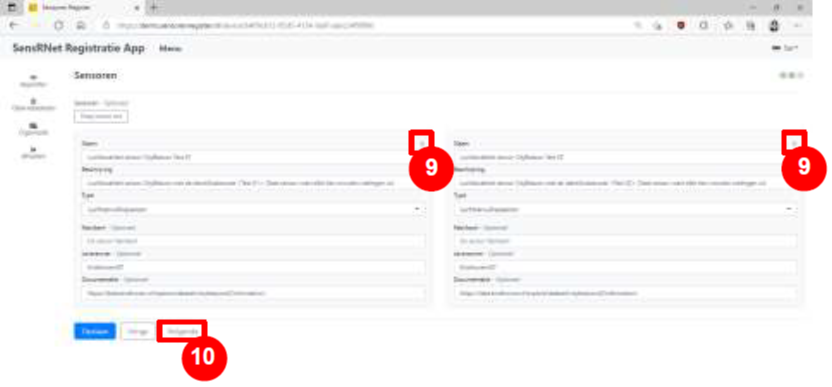

De datastromen kan je wederom verwijderen door op het kruisje te klikken (11). Observatiedoelen kan je ontkoppelen van een datastroom door op het kruisje de klikken binnen het tabje van het betreffende doel (12).

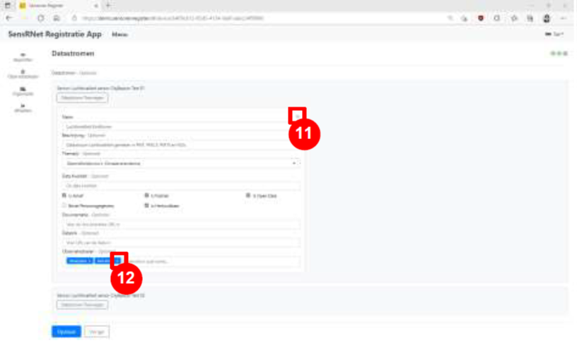

#### Observatiedoelen
_Observatiedoelen kan je ontkoppelen bij de datastroom (12, zie boven), maar kan je ook op zichzelf verwijderen._

Klik in het “Menu” op “Observatiedoelen” (1). Je kan doelen van je eigen organisatie verwijderen door op het afvalbakje te klikken (2).

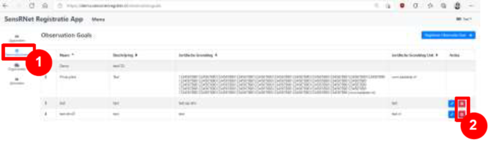

## API

Om apparaten, sensoren, datastromen, en observatiedoelen in bulk op te voeren, te bewerken, of te verwijderen is gebruik van de API efficiënt.

### Access Token

Om de API te kunnen gebruiken, heb je een “access token” nodig. Deze kan je vinden door in het viewerscherm je rechtermuisknop te klikken. Daar kies je voor “Inspecteren”. Onder het tabblad “Application” kan je vervolgens het benodigde token kopiëren.

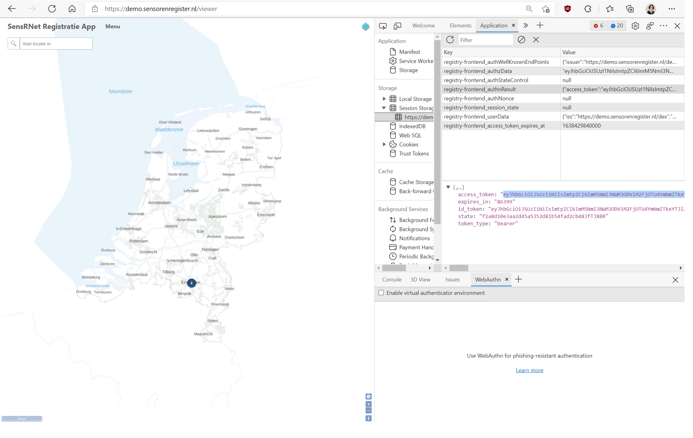

(Afhankelijk van welke browser je gebruikt, zal het scherm en de opties iets afwijken van bovenstaande beschrijving.)

Je access token dien je dagelijks te actualiseren.

### Basis URL

De API werkt op basis van verschillende URL’s (linkjes). Je vult steeds dezelfde basis URL aan met specifieke toevoegingen voor de verschillende opties. De demo omgeving en de productie omgeving hebben elk hun eigen basis URL:

| Demo                                                       |
| ---------------------------------------------------------- |
| [Registry Node API](https://demo.sensorenregister.nl/api/) |

De relevante aanvullingen op de basis URL’s voor het opvoeren, wijzigen, en verwijderen van apparaten, sensoren, datastromen, en observatiedoelen, zijn in deze handleiding terug te vinden in onderstaande secties.

### Script

Om gemakkelijk en geautomatiseerd gebruik te maken van de API is er een FME script beschikbaar (incl. data templates in MS Excel formaat).
Dit script is [hier](./SensRNet-RegistryNode-FME-Scripts.zip) te downloaden (incl. templates voor de data).

### Gegevens opvoeren

_Binnen het register kan een apparaat (topografisch object), een of meerdere sensoren hebben (1:n). Deze sensoren kunnen elk een of meerdere datastromen hebben, met elk weer geen, een, of meerdere observatiedoelen._

**Mogelijke methodiek 1:n opvoer gegevens**

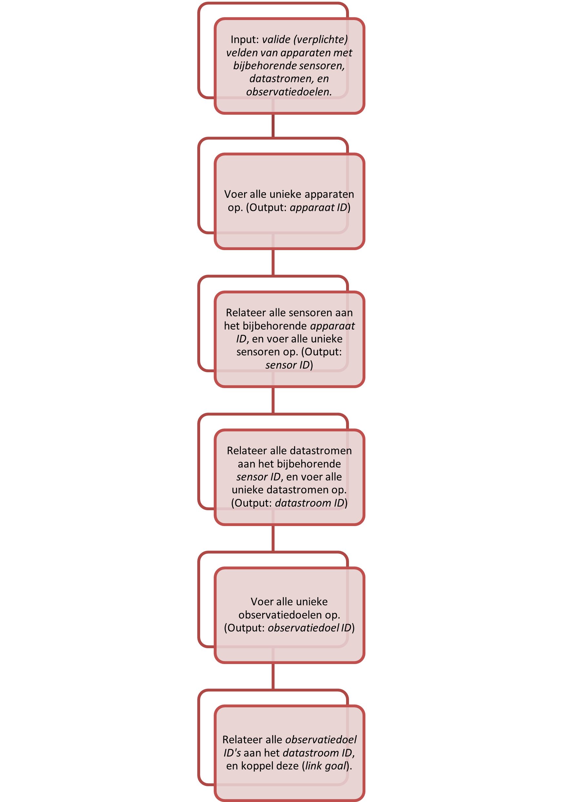

**Instructie gebruik FME script opvoer gegevens**

Bovenstaande zijn de losse stappen die in een script zijn geautomatiseerd.

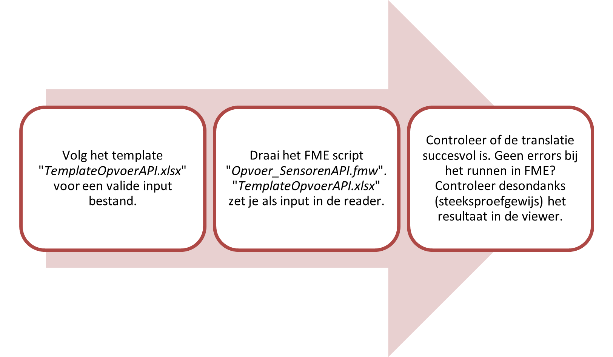

Houd rekening met de volgende aannames om onverwachtste resultaten te voorkomen:

- De input is conform `TemplateOpvoerAPI.xlsx` (te vinden in de zip file van het script of met deze [directe link](TemplateOpvoerAPI.xlsx)).
  Elke unieke combinatie van apparaten, sensoren, datastromen, en observatiedoelen heeft in de lijst een eigen rij.
  Een apparaat komt dus meerdere keren in de input lijst voor wanneer er bijvoorbeeld meerdere sensoren zijn.
  Een sensor en het bijbehorende apparaat komen meerdere keren voor bij meerdere datastromen, etc.
- Het script controleert niét of de betreffende apparaten, sensoren, en datastromen al eerder zijn opgevoerd.
  Controleer dit dus zelf.
  Voor een toevoeging van een sensor aan een bestaande device, en/of een toevoeging van een bestaande datastroom is dit script (nog) niet geschikt.
- Het script volgt de aanname dat unieke sensoren te onderscheiden zijn door in verschil in attributen (bijvoorbeeld door een andere naam). 
- Het script volgt de aanname dat datastromen met precies dezelfde velden ook dezelfde observatiedoelen hebben.
- Wijzigt de wijze waarop een veld aangeleverd moet worden (lijst in plaats van een string bijvoorbeeld), of komt er bijvoorbeeld een nieuw veld bij?
  Dan moet deze wijziging zowel in het input template, als het script handmatig worden doorgevoerd.

**LET OP:** Het script betreft géén productie versie. Mogelijke fouten of afwijkingen van bovenstaande aannames worden niet afgevangen. Blijft dus kritisch bij gebruik.

**Gebruikte URL’s voor opvoer gegevens**

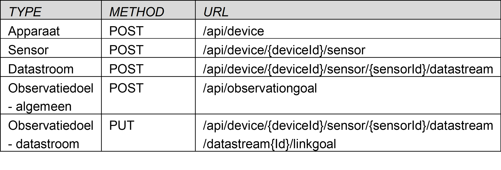

### Gegevens bewerken
Voordat je gegevens kan bewerken, wil je natuurlijk weten wat de huidige stand van zaken is. Om de actuele stand van jouw organisatie (LegalEntity) op te halen, heb je het attribuut LegalEntity_id nodig. Deze kan je ophalen met de GET request: {basis URL}/api/legalentity. Vervolgens haal je met {basis URL}/api/device alle attributen van apparaten, sensoren, datastromen, en ID's van observatiedoelen van jouw organisatie op. Door de structuur van de response en de ID's kan je deze aan elkaar relateren.

**Mogelijke methodiek bewerken gegevens**

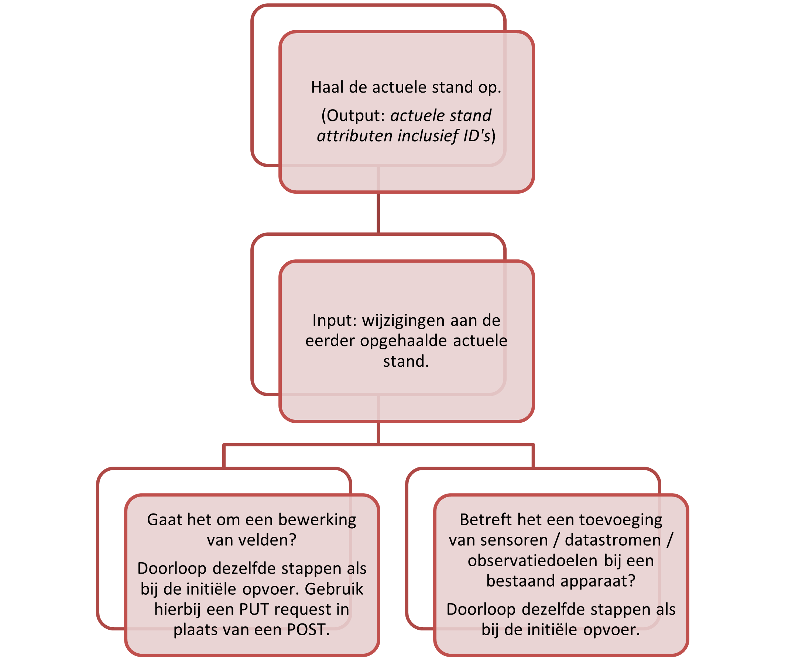

**Instructie gebruik FME script bewerken gegevens**

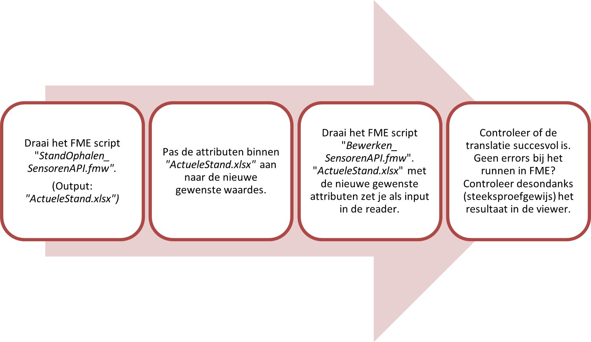

Houd rekening met de volgende aannames om onverwachtste resultaten te voorkomen:

- Wil je een nieuwe sensor koppelen aan een bestaande device, of een nieuwe datastroom aan een bestaande sensor, dan kan je hiervoor ook ActueleStand.xlsx gebruiken. 
  Laat je het veld voor de ID’s van de datastroom en / of sensor leeg, dan herkent het script dat het om een nieuwe opvoer gaat.
- De attributen van ObservationGoals zijn niet in bulk aan te passen met het FME script *Bewerken_ SensorenAPI.fmw*. 
  De aanname is namelijk dat het bulk bewerken van deze gevallen niet of nauwelijks van toegevoegde waarde is. Dit is efficiënt handmatig te volbrengen in de tool. 
- Wel zijn er nieuwe doelen te linken aan datastromen op basis van ID’s, door nieuwe ID’s toe te voegen in de lijst. 
  Gebruik {basis URL}/api/observationgoal op de ID’s van bestaande observatiedoelen te achterhalen, zodat deze in bulk aan datastromen gekoppeld kunnen worden.
- Met het ontkoppelen van observatiedoelen is in het huidige script geen rekening gehouden.
  
**LET OP:** Het script betreft géén afgewerkte productie versie. Mogelijk bevat het script fouten, of ontstaan er fouten wanneer wordt afgeweken van bovenstaande procedure. Blijft dus kritisch bij gebruik.

**Gebruikte URL’s voor bewerken gegevens**

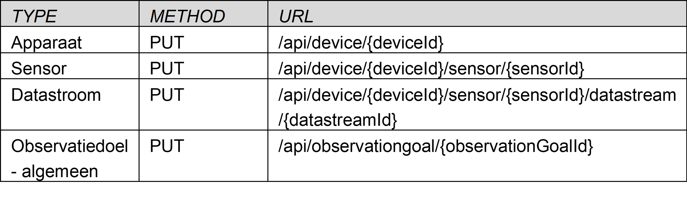
  
### Gegevens verwijderen

Verwijder je een apparaat, dan verdwijnen de onderliggende sensoren en datastromen.
Verwijder je een sensor, dan verdwijnen onderliggende datastromen.
Je kan ook een datastroom op zichzelf verwijderen.
Observatiedoelen kan je ontkoppelen of verwijderen.
Wanneer je een observatiedoel verwijderd, verdwijnt deze bij alle datastromen.

**Mogelijke methodiek verwijderen gegevens**

- Apparaat verwijderen: met het ID van het apparaat.
  Hiermee verdwijnen ook de onderliggende sensoren en datastromen.
- Sensor verwijderen: met de ID’s van het apparaat en de betreffende sensor.
  Hiermee verdwijnen ook de onderliggende datastromen.
- Datastroom verwijderen: met de ID’s van het apparaat, de sensor, en de betreffende datastroom.
- Observatiedoel ontkoppelen: met de ID’s van het device, sensor, datastroom, en observatiedoel.
- Observatiedoel verwijderen: met het ID van het observatiedoel dat je wilt verwijderen.
  Het observatiedoel verdwijnt dan bij alle datastromen.

ID’s kan je achterhalen als response bij de opvoer, of door de huidige stand van jouw organisatie op te halen via de API _(uitleg hierover staat bij [API/Gegevens bewerken](#gegevens-bewerken_1))._

**Instructie gebruik FME script verwijderen gegevens**

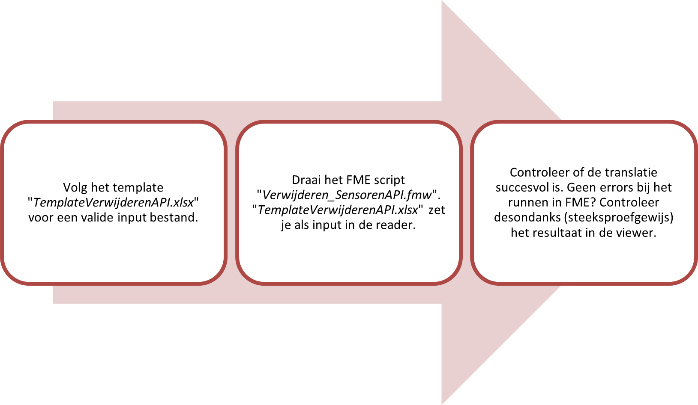

**LET OP:** Het script betreft géén afgewerkte productie versie. Mogelijk bevat het script fouten, of ontstaan er fouten wanneer wordt afgeweken van bovenstaande procedure. Blijft dus kritisch bij gebruik.

**Gebruikte URL’s voor verwijderen gegevens**

### Overige opties API

Toevoegen, updaten, en verwijderen van Gebruikers (User) en Organisaties (LegalEntity) kan ook met behulp van de API.
Voor deze toepassingen zijn bulk actie uitgevoerd door beheerders van sensoren minder voor de hand liggend en kan (waarschijnlijk) efficiënter de tool of eigen brondata gebruikt worden.

Bovenstaande toepassingen vallen dan ook buiten de scope van deze handleiding. Wil je meer informatie? Bekijk dan de documentatie van de API:

| Demo                                                       |
| ---------------------------------------------------------- |
| [Registry Node API](https://demo.sensorenregister.nl/api/) |

## Publicatie in Central Viewer

Zo. Je sensoren zijn opgevoerd. Maar hoe ziet dit er voor de burgers uit? Zij kunnen publieke sensoren bekijken in de viewers:

| Productie                                            | Demo                                                      |
| ---------------------------------------------------- | --------------------------------------------------------- |
| [Central Viewer](https://viewer.sensorenregister.nl) | [Central Viewer](https://demo.sensorenregister.nl/viewer) |
| [API](https://viewer.sensorenregister.nl/api/)       |                                                           |

## Waardelijsten

Vanuit privacy-overwegingen is het onwenselijk om e-mailadressen van privépersonen vast te leggen.
Voor de publieke contactgegevens rondom sensoren is een lijst opgesteld met mogelijke wildcards, waaraan de opgegeven e-mailadressen worden getoetst. 

- [E-mail masks](img/UserManualNL/SensRNet_Waardelijst_Public_E-mail-mask.png) (plaatje)
- [E-mail masks in Excel](Waardelijst_Public_E-mail-mask.xlsx)

Van de opgenomen datastream wordt de functionele classificatie vastgelegd in Theme/Thema.
Mogelijke waarden (uit [Thema-indeling voor officiële publicaties (TOP lijst)](https://standaarden.overheid.nl/owms/4.0/doc/waardelijsten/thema-indeling-voor-officiele-publicaties):

- [Themes](img/UserManualNL/SensRNet_Waardelijst_Datastreams_Themes.png) (plaatje)
- [Themes in Excel](Waardelijst_Datastreams_Themes.xlsx)

Van de geregistreerde sensoren willen we het type weten op basis van de technische werking (wat meet het?).
Mogelijke waarden volgen de opsomming op [Wikipedia](https://en.wikipedia.org/wiki/List_of_sensors):

- [SensorTypes](img/UserManualNL/SensRNet_Waardelijst_Sensortypes.png) (plaatje)
- [Sensortypes in Excel](Waardelijst_Sensortypes.xlsx)

Nuttige informatie is ook te vinden in:

- [SensRNet Datamodel](Model.md)
- [SensRNet Datadefinities](https://github.com/kadaster-labs/sensrnet-home/blob/main/docs/Definitions.rst)
