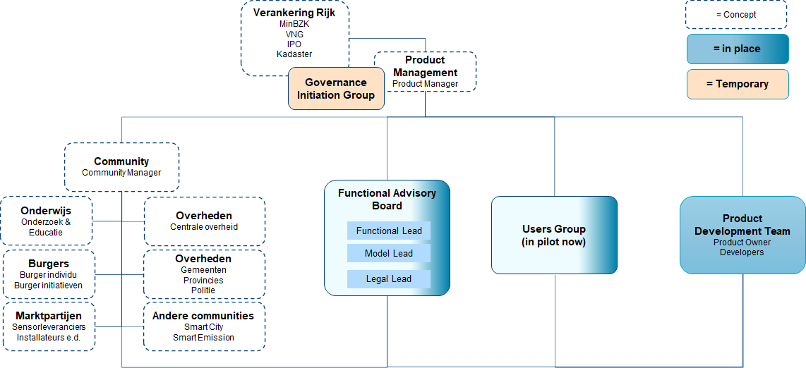

# Users Group

_(Dutch only for now)_ | [link to notes / notulen](../notes)

De GebruikersGroep (Users Group) is de groep van gebruikers van de SensRNet software.
In grote lijnen zijn dat gebruikers die de SensRNet Registry Node software gebruiken en gebruikers die eigen / andere software gebruiken en alleen deelnemen in het SensRNet netwerk (mbv de Sync component).

Op dit moment bestaat er nog geen andere software dan alleen de SensRNet Registry Node software om deel te nemen aan het SensRNet netwerk. Bovendien is de status van SensRNet om van `alpha` (Walking Skeleton) naar `beta` te ontwikkelen. Daarom is de huidige GebruikersGroep in vorming en wordt de **Pilotgroep** genoemd.

De Pilotgroep bestaat op dit moment uitsluitend uit de BrabantStad gemeenten: Gemeente Eindhoven, Gemeente Tilburg, Gemeente Den Bosch. Binnenkort gaat ook Provincie Noord Brabant aansluiten in deze groep.

Users Group in context van gehele SensRNet organisatie in wording:

Bovenstaande organigram is in wording en nog niet gerealiseerd. Wel is de Users Group in beperkte vorm opgezet om input voor het Product Development Team te kunnen leveren om een MVP te kunnen ontwikkelen. In beperkte vorm aangezien er nog geen grotere 'kapstok' is om de Users Group in bovenstaande hoedanigheid te positioneren. We zijn onderweg naar morgen ;-)
